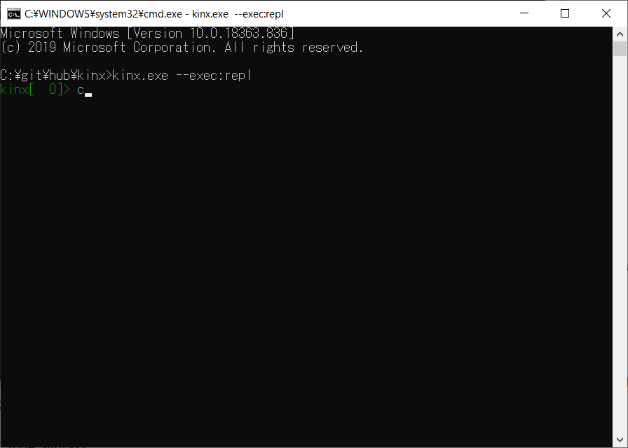
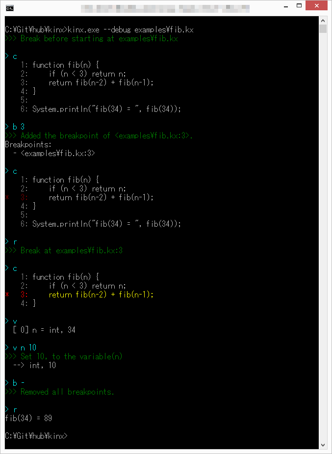
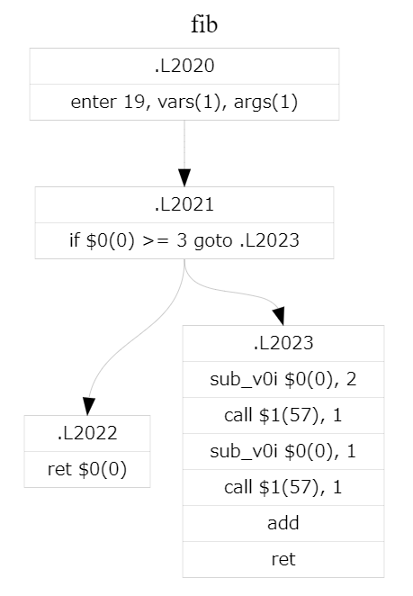

<p align="right">
    
    
    
</p>
<p align="center"></p>
<p align="center">
Looks like JavaScript, feels like Ruby, and it is a script language fitting in C programmers.
</p>

## Topics

* **Preview Release 1.0.0 is now available!** See <a href="https://github.com/Kray-G/kinx/releases">Releases</a>.<br />
* Now the Kinx is supporting the platform of **x86-64 Windows and Linux only**,  because I have no environment.
  *  If you are interested in other platforms, **please check [here](#how-to-support-a-platform)**.
*  **See [ChangeLog.md](ChangeLog.md)** about the history of this project.

## Introduction

Ruby is a major scripting language. Also Python is.
However, either of these syntax is **NOT** familiar to C programmers.
This Kinx is a script language for people who want C-like syntax.

### Features

#### Language Basic Concept

*   **Extendable**. Contributers are able to extend features easily for your own use.
*   **Lightweight**. You can start using this without a lot of work.
*   **Small**. Using C instead of C++. I love C++ but runtime is big in some cases.
*   **Object-Oriented**. Of course you can do the object-oriented programming.
*   C style syntax... no it is **JavaScript style syntax** rather than C, but it is also good.
*   **Dynamic typing**, but you can also specify the type.
*   **Native function** by JIT compiling supported with some limitations. Very fast.
*   **Classes** and inheritance, **Higher order functions**, **Lexical scoping**, **Closures**, **Fiber**, **Garbage Collection**, and so on.
*   **Isolate** object to control native threads **without GIL** (Global Interpreter Lock).
*   Including useful libraries as **All-In-One**. See details below.
*   **[REPL](docs/utility/repl.md)** is provided by default.
*   **[Debugger](docs/utility/debugger.md)** is available and embedded in Kinx. Use the option `--debug` and you can run a script with debugger.
*   Useful Testing System named as **[SpecTest](docs/index.md)**. It is designed to not only for Kinx but also for any other products.

#### Standard Libraries

The script language is a platform as a glue between libraries.
This means a language itself is not a main purpose, it should be just a backend or supporter due to use a library you want to use.

Therefore another design goal for this language is to be extendable, lightweight, and easy to use for user's own purpose.
Kinx will be able to be the best platform for any libraries which you want to use or your own library.

Kinx is including useful libraries below in the standard package as **All-In-One**.

* **Zip** ... Zip/Unzip with not only zip password but also AES password.
* **Xml** ... Supporting XML as DOM structure.
* **libCurl** ... Only HTTP has been already implemented.
* **SSH** ... SSH login and you can execute commands.
* **Socket** ... Supporting a simple TCP/UDP socket.
* **Iconv** ... Converting between text encodings.
* **SQLite3** ... Database class as a usuful library wapping SQLite3.
* **Regular Expression** ... Regular expression is of course supported.
* **Parser Combinator** ... Exactly original implementation of Parser Combinator named as `Parsek` like `Parsec`.
* **PDF** ... PDF core library based on HaruPDF.
* **JIT** ... JIT library for various platforms by an abstracted assembler library.

Making libraries improvement and extension is one of the main purpose of this language.

### Language Details

There is [Quick Reference Guide](docs/QuickReference.md).
Please see [Quick Reference Guide](docs/QuickReference.md) for your understanding.

For the detail of Kinx specification, see [Kinx Specification](docs/index.md).
This document is also including **Test Codes**.
I named this system as **SpecTest**.
See **[SpecTest](docs/index.md)** for detail.

And you can try it on the **[REPL](docs/utility/repl.md)**.
See **[REPL](docs/utility/repl.md)** for detail.

### Motivation

I guess almost all programmers want a lightweight scripting language with C style syntax
because it is simple, easy, and familiar to them.
C style syntax is the most fitting in the programmer's hand, I guess.

Any other languages are also all good solution, but for me...

*   Ruby is great. But it is too far from C style. Too many typing for `end`.
*   Python is also great. But it is too far from C style. Indentend style is a little cramped and too many typing for `self`.
*   JavaScript is very good for me, and it is a C like style. But node.js is too heavy.

#### What is C Style Syntax?

Sharing the definition of **C Style Syntax**, it is below.

*   **Block** is a scope between `{` and `}`
*   Mostly **freedom** style of indent.
*   **Fallthrough** in switch case. *... `switch-when` is now supported without fallthrough by default.*
    *   C programmers will feel it to continue to the next case when there is no `break` statement.
*   etc.

There are a lot of pros and cons about `switch-case`.
Therefore now the followings are  supported instead of `switch-case`.
You can use it as it depends on your situation.

*   If you want to do it without `break`, you can use **[switch-when](docs/spec/statement/switch_when.md)** instead for that purpose.
*   You can also use **[case-when](docs/spec/statement/expression/case_when.md)** as an expression with a pattern matching syntax.

As C style Syntax family there are C, C++, Java, JavaScript, C#, and so on.
If you agree, or if you don't agree, anyway push the star.

## Getting Started

### Supported Platforms

Currently this project supports x86-64 Windows and Linux only.
I really want someone to support any other platforms if possible because I do not have any other platform environment.
Please see detail [here](#how-to-support-a-platform)

### How to Build

> **IMPORTANT**  
> If you faced a crash of the `kinx` executable, please try `make clean all` to re-build everything.
> Sometimes changing a structure in common header will cause a crash because dependencies in Makefile are imcomplete.

#### Windows

On Windows, tested with Visual Studio 2017 Express Edition with x64.
To build, see below.

```
$ make.cmd
```

Note that on Windows, compiling `ir_exec.c` takes long time around 15 minutes, so please wait for it.
It is no problem on Linux because it is around 2 or 3 minutes.

#### Linux

On Linux, tested with gcc 7.4.0 with x64.
To build, see below.

```
$ make
```

#### How to Support a Platform

If anyone wants to support some other platform, the followings have to be done.

1. Now `utliity/kmyacc` is prepared only for x86-64 Windows and Linux.
    * About this, I did commit directly the generated parser file by yacc. Use those files directly in Makefile.
2. There are some dependent libraries in this repo. I think it is not a good way but I am doing so for convenience. Those libraries are put under `src/extlib` folder. Some are located it as a source code but some are located as a pre-built component. Currently there are 6 projects which is prepared as a pre-built component such as  libcurl, libharu, libssh2, libxml2, openssl, and zip(minizip).
    * Create a folder for the target platform and prebuilding and putting a library under that folder each library.
    * Prepare a Makefile for the target platform to compile with above libraries.

### How to Install

#### Windows or Linux

You can download an installer from [Releases](https://github.com/Kray-G/kinx/releases) page.

##### by Scoop (for Windows users)

Or you also can install by [scoop](https://scoop.sh). Type the below:

```ps1
scoop bucket add kinx https://github.com/Kray-G/kinx # only needed the first time
scoop install kinx
```

### How to Execute

#### Usage

```
# For Windows
$ kinx.exe [options] [<script-file>]

# For Linux
$ ./kinx [options] [<script-file>]
```

#### Options

Here is current available options.

|          Option           |                                     Description                                     |
| ------------------------- | ----------------------------------------------------------------------------------- |
| `-h`                      | Display help.                                                                       |
| `-v`, `--version`         | Display version number.                                                             |
| `-d`                      | Dump compiled code.                                                                 |
| `-D`                      | Display AST.                                                                        |
| `-i`                      | Input source code from stdin.                                                       |
| `-c`                      | Check the syntax only without any executions.                                       |
| `-q`                      | Do quiet mode without displaying warning & error, and exit code 0 means successful. |
|                           |                                                                                     |
| `--debug`                 | Debugger mode and run with a debugger.                                              |
| `--dot`                   | Output the dump by .dot format.                                                     |
| `--with-native`           | Dump compiled code of a native function. Use with `-d`.                             |
| `--native-call-max-depth` | Specify the max depth to call a native function. 1024 by default.                   |
| `--case-threshold`        | Specify the max interval between case's integer value. 16 by default.               |
|                           |                                                                                     |
| `--exec:repl`             | Run the **Repl**.                                                                   |
| `--exec:spectest`         | Run the **SpecTest**.                                                               |

## Examples

You will think it is like JavaScript.

### Fibonacci

```js
function fib(n) {
    if (n < 3) return n;
    return fib(n-2) + fib(n-1);
}

System.println("fib(34) = ", fib(34));
```

### Factorial

```js
function fact(n) {
    if (n < 1) return 1;
    return n * fact(n-1);
}

System.println(fact(5000));
```

### Class

```coffee
class Example(i) {
    public get() { return i; }
}

System.println(new Example(100).get());
```

### Native

#### What is Native function?

Remember the fibonacci function above.
That is a simple fibonacci function and execute it with time measurement like below.

```
$ time ./kinx examples/fib.kx
fib(34) = 9227465

real    0m0.718s
user    0m0.609s
sys     0m0.000s
```

Replace `function` to `native`.
That's all.

```js
native fib(n) {
    if (n < 3) return n;
    return fib(n-2) + fib(n-1);
}

System.println("fib(34) = ", fib(34));
```

Let's execute it and measure it!

```
$ time ./kinx examples/native_fib.kx
fib(34) = 9227465

real    0m0.167s
user    0m0.063s
sys     0m0.016s
```

How nice it is around 10x faster.

But you have to know the limitations with native function.
See [Native Functions](docs/spec/definition/native.md) for details.

### REPL

You can use REPL (Read-Eval-Print-Loop) with the option of `--exec:repl` as below.

```
$ ./kinx --exec:repl
```

Here is a demo animation. REPL has an autocomplete by `[TAB]` key.
See [REPL](docs/utility/repl.md) for details.

Have fun with it!

<p align="center"></p>

### Debugger

Debugger is now available. Run with the `--debug` option.

```
$ ./kinx --debug script.kx
```

Here is a sample screen shot.
See [Kinx Debugger](docs/utility/debugger.md) for details.

<p align="center"></p>

### Output with Dot

Kinx accepts `--dot` option for outputting by .dot format as below.

```
digraph fib {
        node [fontname="Courier_New",fontsize=10,style="setlinewidth(0.1)",shape=record];
        edge [fontname="Courier_New",fontsize=10,style="setlinewidth(0.1)"];
        label="fib"
        labelloc="t"
        L2020 [label="{ \.L2020 | enter 19, vars(1), args(1) }"];
        L2021 [label="{ \.L2021 | if $0(0) \>= 3 goto \.L2023 }"];
        L2022 [label="{ \.L2022 | ret $0(0) }"];
        L2023 [label="{ \.L2023 | sub_v0i $0(0), 2 | call $1(57), 1 | sub_v0i $0(0), 1 | call $1(57), 1 | add | ret }"];
        L2020:s -> L2021:n;
        L2021:s -> L2023:n;
        L2021:s -> L2022:n;
}
```

<p align="center"></p>

### Extending Functionalities

You can add the functionalities easily.
Basic strategy is to add the dll following by some rules.

First, you use `using` directive like this.

```js
using YourLibrary;
```

This means to load `YourLibrary.kx`. The library is searched by the order below.

*   Current directory.
*   The same directory as executable of `kinx`.
*   The child `lib` directory of a directory of `kinx` executable.
*   The child `lib` directory of a parent directory of `kinx` executable.

If you want to use your own `yourlibrary.dll`, write the code below inside `YourLibrary.kx`.

```js
var YourLibrary = _import("yourlibrary");
```

*   About a dll rule is like below.
    *   See [`kxstring.c`](src/extlib/kxstring.c) for single object. It will be very simple example.
    *   See [`kxregex.c`](src/extlib/kxregex.c) for class definition. Just defines a `create` method for `new` operator.

For `new` operator, `new A` is just alias of `A.create`.
See [Class Design](docs/HowClassWorks.md) for how class works.

## TODO

See [ChangeLog.md](ChangeLog.md) for a current status.

## Undocumented Memo

For specification, see [Kinx Specification](docs/spec/README.md).
But now there is no document about following items.
I will write it as soon as possible.

### libCurl

Now libcurl package is included in Kinx. example
Simple HTTP Get client library is [`net/http.kx`](lib/std/net/http.kx) in `lib/std` folder from [`kxnet.kx`](lib/std/kxnet.kx).
This is very poor but will be easy to upgrade it.

Simple HTTP Get client is also [`http.kx`](examples/http.kx) in example folder.

Note that OpenSSL is also included.
OpenSSL version is 3.0.0, which is not released officially but means the license is Apache 2.0.

### eval

`eval()` is now supported.
You can run the code of string on the fly.
The eval's arguments are assigned to `$$` like command line arguments as an array.

### using directive

You can use `using` to include another source file.

```coffee
using dir.to.path.file1;
using? dir.to.path.file2;
```

When you use `using` and the file is not found, it will make it error.
When you use `using?` instead, it will be ignored without errors even if the file is not found.

The library is searched by the following order.

*   Current directory.
*   The same directory as executable of `kinx`.
*   The child `lib` directory of a directory of `kinx` executable.
*   The child `lib` directory of a parent directory of `kinx` executable.

### Alternative Function Call Value

When you call `someMethod` but `methodMissing` occurs for an object,
searching a `_someMethod` property and use the value of it if found.
It is sometimes reasonable because you do not have to define the function.

```coffee
var obj = { _msg: "message" };
System.println(obj.msg()); # => print out "message".
```

## License

This project is licensed under the **MIT License**.
See the [LICENSE](LICENSE) file for details.
About the licenses of internal used libraries, follow the licenses of each library.
See [docs/licenses](docs/licenses) folder for details.
