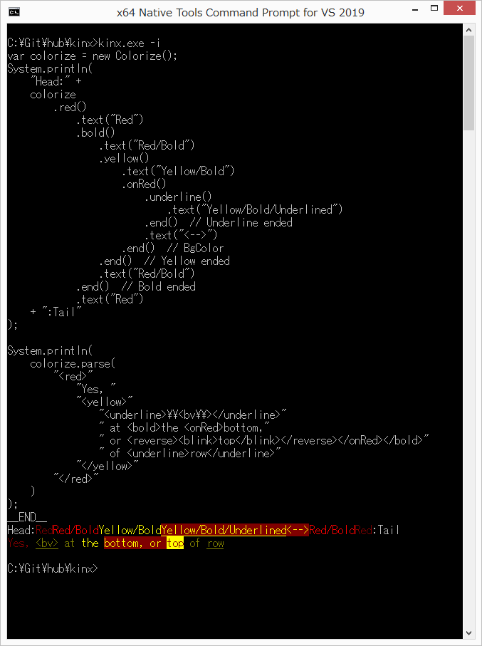

# Colorize

## Overview

`Colorize` is a library of coloring and decorating a string by Escape Sequence.
There are 2 ways of decoration.

1. Use a `String` methods directly.
2. Use a `Colorize` class.

Here it is described about `Colorize` class.
See [String](../primitive/string.md) for how to use `String` methods directly.

## Colorize

### Method Chain

`Colorize` have following methods to change an attribute of a string.

|    Method     |                    Meaning                     |
| ------------- | ---------------------------------------------- |
| `black()`     | Sets black as a foreground color.              |
| `red()`       | Sets red as a foreground color.                |
| `green()`     | Sets green as a foreground color.              |
| `yellow()`    | Sets yellow as a foreground color.             |
| `blue()`      | Sets blue as a foreground color.               |
| `magenta()`   | Sets magenta as a foreground color.            |
| `cyan()`      | Sets cyan as a foreground color.               |
| `white()`     | Sets white as a foreground color.              |
| `onBlack()`   | Sets black as a background color.              |
| `onRed()`     | Sets red as a background color.                |
| `onGreen()`   | Sets green as a background color.              |
| `onYellow()`  | Sets yellow as a background color.             |
| `onBlue()`    | Sets blue as a background color.               |
| `onMagenta()` | Sets magenta as a background color.            |
| `onCyan()`    | Sets cyan as a background color.               |
| `onWhite()`   | Sets white as a background color.              |
| `bold()`      | Sets a bold style.                             |
| `underline()` | Sets an uderline.                              |
| `reverse()`   | Exchanges a foreground and a background color. |
| `clear()`     | Clears all attributes.                         |
| `end()`       | Ends a right previous attribute change.        |
| `text(str)`   | Sets a text with a changed attribute.          |

### Parsing String

The `parse` method of a `Colorize` instance will recognize some tags for coloring and decorating.

|            Method            |                    Meaning                     |
| ---------------------------- | ---------------------------------------------- |
| `<black>...</black>`         | Sets black as a foreground color.              |
| `<red>...</red>`             | Sets red as a foreground color.                |
| `<green>...</green>`         | Sets green as a foreground color.              |
| `<yellow>...</yellow>`       | Sets yellow as a foreground color.             |
| `<blue>...</blue>`           | Sets blue as a foreground color.               |
| `<magenta>...</magenta>`     | Sets magenta as a foreground color.            |
| `<cyan>...</cyan>`           | Sets cyan as a foreground color.               |
| `<white>...</white>`         | Sets white as a foreground color.              |
| `<onBlack>...</onBlack>`     | Sets black as a background color.              |
| `<onRed>...</onRed>`         | Sets red as a background color.                |
| `<onGreen>...</onGreen>`     | Sets green as a background color.              |
| `<onYellow>...</onYellow>`   | Sets yellow as a background color.             |
| `<onBlue>...</onBlue>`       | Sets blue as a background color.               |
| `<onMagenta>...</onMagenta>` | Sets magenta as a background color.            |
| `<onCyan>...</onCyan>`       | Sets cyan as a background color.               |
| `<onWhite>...</onWhite>`     | Sets white as a background color.              |
| `<bold>..</bold>`            | Sets a bold style.                             |
| `<underline>..</underline>`  | Sets an uderline.                              |
| `<reverse>..</reverse>`      | Exchanges a foreground and a background color. |

You can use tags above as follows.

```javascript
var colorize = new Colorize();
System.println(colorize.parse("<yellow><bold>Yellow</bold> Text</yellow>"));
```

## Output Example

Here is an example.

```javascript
var colorize = new Colorize();
System.println(
    "Head:" +
    colorize
        .red()
            .text("Red")
            .bold()
                .text("Red/Bold")
                .yellow()
                    .text("Yellow/Bold")
                    .onRed()
                        .underline()
                            .text("Yellow/Bold/Underlined")
                        .end()  // Underline ended
                        .text("<-->")
                    .end()  // BgColor
                .end()  // Yellow ended
                .text("Red/Bold")
            .end()  // Bold ended
            .text("Red")
    + ":Tail"
);

System.println(
    colorize.parse(
        "<red>"
            "Yes, "
            "<yellow>"
                "<underline>\\<bv\\></underline>"
                " at <bold>the <onRed>bottom,"
                " or <reverse><blink>top</blink></reverse></onRed></bold>"
                " of <underline>row</underline>"
            "</yellow>"
        "</red>"
    )
);
```

Here is an actual result.



