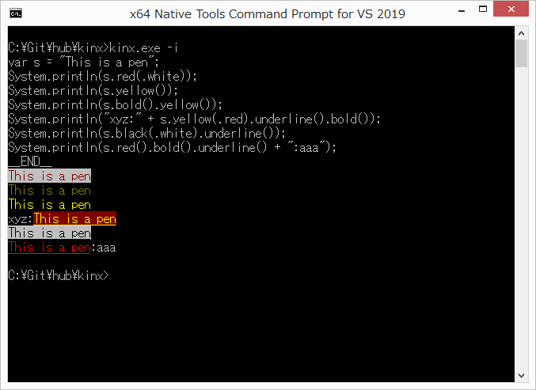

# String

## Overview

String objects are a quoted string like `"aaa"`.
You can write it as a double-quoted or single-quoted string.

### Basic Methods

There is a special object named as `String`.
The methods of `String` can be used for string values directly.

|               Method                |                                                                Meaning                                                                |
| ----------------------------------- | ------------------------------------------------------------------------------------------------------------------------------------- |
| String.startsWith(val, str)         | `true` if `val` is started with `str`.                                                                                                |
| String.endsWith(val, str)           | `true` if `val` is ended with `str`.                                                                                                  |
| String.find(val, str)               | The position started from 0 is returned if `str` is found in `str`. -1 will be returned when it is not found.                         |
| String.subString(val, start[, len]) | A sub string in `val` will be returned.                                                                                               |
| String.replace(val, cond, repl)     | All of matched sub string with `cond` in `val` will be replaced by `repl`. `cond` should be a string or a Regex object.               |
| String.toInt(val)                   | Converts `val` into Integer.                                                                                                          |
| String.toDouble(val)                | Converts `val` into Double.                                                                                                           |
| String.parentPath(val)              | By recognizing `val` as a path string, it will return the parent part. ex) `"ab/cd/ef.x".parentPath()` will return `"ab/cd"`.         |
| String.filename(val)                | By recognizing `val` as a path string, it will return the filename part. ex) `"ab/cd/ef.x".filename()` will return `"ef.x"`           |
| String.stem(val)                    | By recognizing `val` as a path string, it will return the stem part. ex) `"ab/cd/ef.x".stem()` will return `"ef"`                     |
| String.extension(val)               | By recognizing `val` as a path string, it will return the extension part. ex) `"ab/cd/ef.x".extension()` will return `".x"`           |
| String.split(val, sep)              | It will return an array splitted `val` by `sep`. `sep` should be a string or a Regex object.                                          |
| String.each(val, callback)          | It will call `callback` for each character. The second argument for `callback` function will be available as an index started from 0. |

The `String` object can hold any methods you want to add.
For example, see below.

```javascript
String.greeting = function(name) {
    System.println("Hello, I am %{name}.");
};

"John".greeting();
```

Let's run it.

```
Hello, I am John.
```

The receiver comes in the first argument.

### Escape Sequence

You can use an escape sequence easily via some `String` methods.
Those methods currently are supporting to decorate a string such as a coloring.

#### Example of String Decoration

Here is an example of decorating a string.
The decoration range is only a specified string, and the decoration will be automatically cleared.

```javascript
var s = "This is a pen";
System.println(s.red(.white));                              // => \e31;47[mThis is a pen\e[0m
System.println(s.yellow());                                 // => \e33[mThis is a pen\e[0m
System.println(s.bold().yellow());                          // => \e33;1[mThis is a pen\e[0m
System.println("xyz:" + s.yellow(.red).underline().bold()); // => xyz:\e33;41;4;1[mThis is a pen\e[0m
System.println(s.black(.white).underline());                // => \e30;47;4[mThis is a pen\e[0m
System.println(s.red().bold().underline() + ":aaa");        // => \e31;1;4[mThis is a pen\e[0m:aaa
```

Here is an actual result.



#### Methods

Here are methods of coloring and decorating.

|       Method       |                                       Meaning                                        |
| ------------------ | ------------------------------------------------------------------------------------ |
| `black(bgColor)`   | Makes a foreground color black, and optionally possible to set a background color.   |
| `red(bgColor)`     | Makes a foreground color red, and optionally possible to set a background color.     |
| `green(bgColor)`   | Makes a foreground color green, and optionally possible to set a background color.   |
| `yellow(bgColor)`  | Makes a foreground color yellow, and optionally possible to set a background color.  |
| `blue(bgColor)`    | Makes a foreground color blue, and optionally possible to set a background color.    |
| `magenta(bgColor)` | Makes a foreground color magenta, and optionally possible to set a background color. |
| `cyan(bgColor)`    | Makes a foreground color cyan, and optionally possible to set a background color.    |
| `white(bgColor)`   | Makes a foreground color white, and optionally possible to set a background color.   |
| `bold()`           | Makes a string bold.                                                                 |
| `underline()`      | Adds underline to a string.                                                          |

`bgColor` is optional and it is `.` style such as `.white`.
Here is a possible background color setting.
If nothing specified, there is no change to a background color.

| `bgColor`  |              Meaning              |
| ---------- | --------------------------------- |
| `.black`   | Makes a background color black.   |
| `.red`     | Makes a background color red.     |
| `.green`   | Makes a background color green.   |
| `.yellow`  | Makes a background color yellow.  |
| `.blue`    | Makes a background color blue.    |
| `.magenta` | Makes a background color magenta. |
| `.cyan`    | Makes a background color cyan.    |
| `.white`   | Makes a background color white.   |

### Special operator

#### `/` operator

You can use the operator of `/` to join strings by `/`.
It is useful for the path operation.

```javascript
var a = "aa/bb" / "ccdd";   // => "aa/bb/ccdd"
var b = "aa/bb/" / "ccdd";  // => "aa/bb/ccdd"
var c = "aa/bb" / "/ccdd";  // => "aa/bb/ccdd"
```

#### `=~` operator

If you use the operator of `=~` for a string, the right hand side should be a Regex object.
Otherwise an exception will be raised.

#### `!~` operator

If you use the operator of `!~` for a string, the right hand side should be a Regex object.
Otherwise an exception will be raised.

#### Postfix `[]` operator

You can use `[]` operator to access a character in a string by index.
The value will be an integer number as a character code.
Therefore if you want to check the 5th character is `'a'`, you should write it as follows.

```javascript
if (str[5] == 'a'[0]) {
    /* ... */
}
```

Note that it is different from C code.
You need `[0]` because `'a'` is not a character code but *a string literal**.

#### Unary `*` operator

Unary `*` operator for a string will convert it to an array of character codes.

```javascript
var a = *"abc";  // => [97, 98, 99]
```

By the way,  unary `*` operator for an array will convert it back to a string.

## Examples

### Example 1. Normal case

#### Code

```javascript
System.println("This is a pen.");
```

#### Result

```
This is a pen.
```

### Example 2. Greeting

#### Code

```javascript
String.greeting = function(name) {
    System.println("Hello, I am %{name}.");
};

"John".greeting();
```

#### Result

```
Hello, I am John.
```

### Example 3. Path operator

#### Code

```javascript
var a = "aa/bb" / "ccdd";   // => "aa/bb/ccdd"
var b = "aa/bb/" / "ccdd";  // => "aa/bb/ccdd"
var c = "aa/bb" / "/ccdd";  // => "aa/bb/ccdd"
System.println(a);
System.println(b);
System.println(c);
```

#### Result

```
aa/bb/ccdd
aa/bb/ccdd
aa/bb/ccdd
```

### Example 4. Index access

#### Code

```javascript
var a = "aa/bb";
if (a[2] == 'a'[0]) {
    System.println("a");
}
if (a[2] == '/'[0]) {
    System.println("/");
}
if (a[2] == 'b'[0]) {
    System.println("b");
}
```

#### Result

```
/
```

### Example 5. Replacing sub-string

#### Code

```javascript
var a = "abcdefghijklmnaxcabcdefghijklmnaxcabcdefghijklmnaxc";
System.println(a.replace("abc", "___"));
System.println(a.replace(/a(.)c/, "_A$1C_"));
```

#### Result

```
___defghijklmnaxc___defghijklmnaxc___defghijklmnaxc
_AbC_defghijklmn_AxC__AbC_defghijklmn_AxC__AbC_defghijklmn_AxC_
```

### Example 6. Unary `*` operator

#### Code

```javascript
var a = "abcdefghijklmn";
System.println(*a);
System.println(*(*a));
```

#### Result

```
[97, 98, 99, 100, 101, 102, 103, 104, 105, 106, 107, 108, 109, 110]
abcdefghijklmn
```
