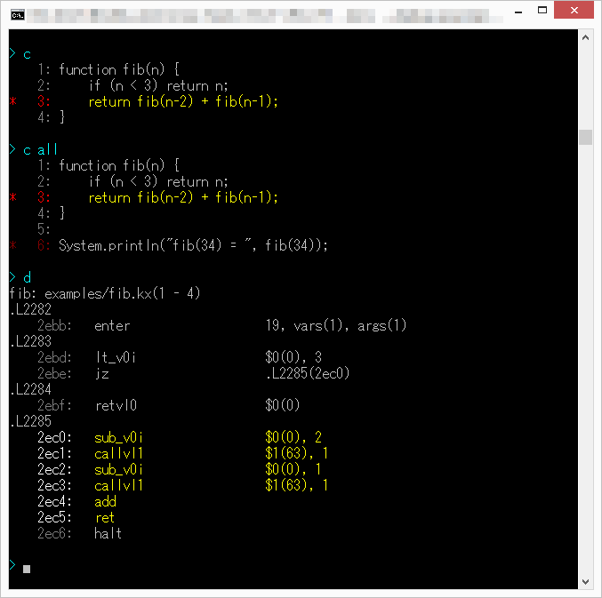

# Kinx Debugger

## Debugger

Kinx Debugger is available and included in the Kinx itself.
The main features are followings.

* Set/Remove Breakpoints.
* Show Frames and Variables, and possible to change a variable value if you need.
* Show a current source code with breakpoints.
* Stepwise execution.

See the example below.
The commands and messages are colored to see easily, but note that there is no color in this document because it is Markdown text.


## Key Binding

This debugger has a simple line editor.
You can use the following keys to edit a command text to debug your program.

|                  Key                  |            Meaning             |
| :-----------------------------------: | ------------------------------ |
| <kbd>&#8593;</kbd> <kbd>&#8595;</kbd> | Select a command from history. |
| <kbd>&#8592;</kbd> <kbd>&#8594;</kbd> | Move the cursor.               |
|             <kbd>BS</kbd>             | Remove a previous character.   |
|            <kbd>DEL</kbd>             | Remove a current character.    |
|           <kbd>Enter</kbd>            | Do the command.                |

## Commands

### Run the Script with Debugger

Run it with `--debug` option, and the script will automatically be stopped before your code.
By the way, the line number of the starting point is '0' but it is no sense.

```
$ kinx --debug script.kx
>>> Break at script.kx:0

> 
```

### Debugger Commands

|  Category   |         Command         |                       Meaning                        |                        Section                        |
| ----------- | ----------------------- | ---------------------------------------------------- | ----------------------------------------------------- |
| Common      | `h` or `help`           | Display the help.                                    | &#8594; [Help](#help)                                 |
|             | `!` or `history`        | Display a command history.                           | &#8594; [History](#history)                           |
|             | `!!`                    | Do the previous command in history.                  | &#8594; [History](#history)                           |
|             | `! [N]`                 | Do the [N]th command in history.                     | &#8594; [History](#history)                           |
| Flow        | `n`                     | Run to the next line by step-in.                     | &#8594; [Stpwise Execution](#stepwise-execution)      |
|             | `nn`                    | Run to the next line by step-out.                    | &#8594; [Stpwise Execution](#stepwise-execution)      |
|             | `r`                     | Run to the next breakpoint.                          | &#8594; [Stpwise Execution](#stepwise-execution)      |
|             | `b`                     | Show breakpoints.                                    | &#8594; [Breakpoints](#breakpoints)                   |
|             | `b [L]`                 | Toggle the breakpoint to the line [L].               | &#8594; [Breakpoints](#breakpoints)                   |
|             | `b -`                   | Remove all breakpoints.                              | &#8594; [Breakpoints](#breakpoints)                   |
| Frames      | `f`                     | Show a frame list on the stack.                      | &#8594; [Frames and Variables](#frames-and-variables) |
|             | `l`                     | Show a lexical frame list of a current frame.        | &#8594; [Frames and Variables](#frames-and-variables) |
|             | `mf [N]`                | Move a current frame to the specified stack frame.   | &#8594; [Frames and Variables](#frames-and-variables) |
|             | `ml [N]`                | Move a current frame to the specified lexical frame. | &#8594; [Frames and Variables](#frames-and-variables) |
| Variables   | `v`                     | Show variables in a current frame.                   | &#8594; [Frames and Variables](#frames-and-variables) |
|             | `vf [N]`                | Show variables of `[N]`th frame on the stack.        | &#8594; [Frames and Variables](#frames-and-variables) |
|             | `vl [N]`                | Show variables of `[N]`th lexical frame.             | &#8594; [Frames and Variables](#frames-and-variables) |
|             | `v [Name]`              | Show details of a variable in a current frame.       | &#8594; [Frames and Variables](#frames-and-variables) |
|             | `v [Name] [Val] [Type]` | Set a value to a variable in a current frame.        | &#8594; [Frames and Variables](#frames-and-variables) |
| Stack       | `s`                     | Show the stack with the first 10 entries.            | &#8594; [Stack](#stack)                               |
|             | `s all`                 | Show the stack all.                                  | &#8594; [Stack](#stack)                               |
| Source Code | `c`                     | Show a source code of a current function.            | &#8594; [Source Code](#source-code)                   |
|             | `c all`                 | Show all of a current source code.                   | &#8594; [Source Code](#source-code)                   |
|             | `d`                     | Dump an IR code of a current function.               | &#8594; [Source Code](#source-code)                   |
|             | `d all`                 | Dump an IR code of a current source code.            | &#8594; [Source Code](#source-code)                   |

The command and a number parameter of an argument can be connected. See example below.

```
> b 3
>>> Added the breakpoint of <examples/fib.kx:3>.
Breakpoints:
  - <examples/fib.kx:3>

> b3
>>> Removed the breakpoint of <examples/fib.kx:3>.
>>> No breakpoints.
```

The command `b` and the number `3` can be written as 1 word like `b3`.

## Features

### Help

Use the command of `h`.

```
Kinx Debugger version 0.1.0

[Common]
  h, help               Display this help.
  !, history            Display a command history.
  !!                    Do the previous command in history.
  ! [N]                 Do the [N]th command in history.

[Flow]
  n                     Run until the next line by step-in.
  nn                    Run until the next line by step-out.
  r                     Run until the next breakpoint.
  b                     Show breakpoints.
  b [L]                 Toggle the breakpoint to the line [L].
  b -                   Remove all breakpoints.

[Frames]
  f                     Show a frame list on the stack.
  l                     Show a lexical frame list of a current frame.
  mf [N]                Move a current frame to the specified stack frame.
  ml [N]                Move a current frame to the specified lexical frame.

[Stack]
  s                     Show the stack with the first 10 entries.
  s all                 Show the stack all.

[Veriables]
  v                     Show variables in a current frame.
  vf [N]                Show variables of [N]th frame on the stack.
  vl [N]                Show variables of [N]th lexical frame.
  v [Name]              Show details of a variable in a current frame.
  v [Name] [Val] [Type] Set the value to a variable in a current frame.
                        Name: Variable name with index or property name.
                              ex) name, name.prop[1].next
                        Type: i ... int
                              d ... dbl
                              s ... str
                              * auto detect by [Val] if not specified.

[Source Code]
  c                     Show a source code of a current function.
  c all                 Show all of a current source code.
  d                     Dump an IR code of a current function.
  d all                 Dump an IR code of a current source code.
```

### Breakpoints

Use the command of `b`.

#### `b`

The command `b` shows all breakpoints.

```
> b
Breakpoints:
  - <script.kx:1>
  - <script.kx:2>
  - <script.kx:3>
```

#### `b [L]`

The command `b` with [L] as a line number means to toggle a breakpoint.
If the breakpoint to that line number has been already set, the breakpoint will be removed.
If it hasn't been set, the breakpoint will be set.

```
> b
>>> No breakpoints.

> b 3
>>> Added the breakpoint of <script.kx:3>.
Breakpoints:
  - <script.kx:3>

> b 2
>>> Added the breakpoint of <script.kx:2>.
Breakpoints:
  - <script.kx:2>
  - <script.kx:3>

> b 2
>>> Removed the breakpoint of <script.kx:2>.
Breakpoints:
  - <script.kx:3>

> b
Breakpoints:
  - <script.kx:3>
```

#### `b -`

The command `b -` means to remove all breakpoints.

```
> b
Breakpoints:
  - <script.kx:1>
  - <script.kx:2>
  - <script.kx:3>

> b -
>>> Removed all breakpoints.

> b
>>> No breakpoints.
```

### Frames and Variables

You can show frames as a call stack, and also show lexical frames.
The features are followings.

* Show frames as a call stack.
* Show lexical frames of a current frame.
* Move a current frame.
* Show variables in a frame.
* Change a value of a variable in a current frame.

#### `f`

The command `f` shows a frame list as a call stack, and `[*]` shows a current frame.

```
> f
 [*] [  54] fib (examples\fib.kx:3)
  -  [  49] fib (examples\fib.kx:3)
  -  [  44] fib (examples\fib.kx:3)
  -  [  39] fib (examples\fib.kx:3)
  -  [  34] fib (examples\fib.kx:3)
  -  [  29] fib (examples\fib.kx:3)
  -  [  24] fib (examples\fib.kx:3)
  -  [  19] fib (examples\fib.kx:3)
  -  [  14] fib (examples\fib.kx:3)
  -  [   9] fib (examples\fib.kx:3)
  -  [   4] <main-block> (examples\fib.kx:6)
```

#### `l`

The command `l` shows lexical frames from a current frame.

```
> l
 [*] [  54] fib (examples\fib.kx:3)
  -  [   4] lexical frame
```

#### `mf`

The command `mf` will change a current frame to the frame which you select from stack frames.
You should specify a frame number shown by the command `f`.

```
> f
 [*] [  54] fib (examples\fib.kx:3)
  -  [  49] fib (examples\fib.kx:3)
  -  [  44] fib (examples\fib.kx:3)
  -  [  39] fib (examples\fib.kx:3)
  -  [  34] fib (examples\fib.kx:3)
  -  [  29] fib (examples\fib.kx:3)
  -  [  24] fib (examples\fib.kx:3)
  -  [  19] fib (examples\fib.kx:3)
  -  [  14] fib (examples\fib.kx:3)
  -  [   9] fib (examples\fib.kx:3)
  -  [   4] <main-block> (examples\fib.kx:6)

> mf 39

> f
  -  [  54] fib (examples\fib.kx:3)
  -  [  49] fib (examples\fib.kx:3)
  -  [  44] fib (examples\fib.kx:3)
 [*] [  39] fib (examples\fib.kx:3)
  -  [  34] fib (examples\fib.kx:3)
  -  [  29] fib (examples\fib.kx:3)
  -  [  24] fib (examples\fib.kx:3)
  -  [  19] fib (examples\fib.kx:3)
  -  [  14] fib (examples\fib.kx:3)
  -  [   9] fib (examples\fib.kx:3)
  -  [   4] <main-block> (examples\fib.kx:6)
```

After changing a current frame, the lexical frames will be shown from the new current frame by the command `l`.

```
> l
 [*] [  39] fib (examples\fib.kx:3)
  -  [   4] lexical frame
```

The lexical frame list is same in the above example, but normally a lexical frame list is often different each frame.

#### `ml`

The command `ml` will change a current frame to the frame which you select from lexical frames.
You should specify a frame number shown by the command `l`.

```

> l
 [*] [  54] fib (examples\fib.kx:3)
  -  [   4] lexical frame

> ml 4

> l
 [*] [   4] fib (examples\fib.kx:3)
```

#### `v`

The command shows variables of the current frame.

```
> v
  [ 0] n = int, 16
```

#### `vf [N]`

The command `vf` shows a variable list which the frame number [N] on the stack holds.
By this, you do not have to change a current frame to see the variables held in a frame.

```
> f
 [*] [  54] fib (examples\fib.kx:3)
  -  [  49] fib (examples\fib.kx:3)
  -  [  44] fib (examples\fib.kx:3)
  -  [  39] fib (examples\fib.kx:3)
  -  [  34] fib (examples\fib.kx:3)
  -  [  29] fib (examples\fib.kx:3)
  -  [  24] fib (examples\fib.kx:3)
  -  [  19] fib (examples\fib.kx:3)
  -  [  14] fib (examples\fib.kx:3)
  -  [   9] fib (examples\fib.kx:3)
  -  [   4] <main-block> (examples\fib.kx:6)

> v
  [ 0] n = int, 16

> vf 49
  [ 0] n = int, 18

> vf 39
  [ 0] n = int, 22
```

#### `vl [N]`

The command `vl` shows a variable list which the frame number [N] on lexical frames holds.
By this, you do not have to change a current frame to see the variables held in a frame.

```
> l
 [*] [  54] fib (examples\fib.kx:3)
  -  [   4] lexical frame

> v
  [ 0] n = int, 16

> vl 4
  [ 0] $$ = obj
  [ 1] STDIN = obj
```

In the above example's case, `vf 4` and `vl 4` is the same meaning because the frame number 4 is also on the stack.
But sometimes, a lexical frame is not on the stack. This `vl` command is useful in that case.

#### `v [Name]`

If you use `[Name]` with the command `v`, you can see inside of the variable.
See example below, and you can see the property name and array index is available in the `[Name]`.

For example, make it stop at the `return` by setting a breakpoint in the following source code.

```javascript
function test() {
    var a = {
        x: [1, 2, 3],
        y: [200, 300, {
            a: 1000,
            b: 2000,
        }]
    };
    return a;
}
System.println(test());
```

This example is a little long but you had better see it all to understand it.
By the way, the command `c` will show a source code.

```
$ kinx --debug test.kx
>>> Break before starting at test.kx

> c
    1: function test() {
    2:     var a = {
    3:         x: [1, 2, 3],
    4:         y: [200, 300, {
    5:             a: 1000,
    6:             b: 2000,
    7:         }]
    8:     };
    9:     return a;
   10: }
   11: System.println(test());

> b 9
>>> Added the breakpoint of <test.kx:9>.
Breakpoints:
  - <test.kx:9>

> r
>>> Break at test.kx:9

> c
    1: function test() {
    2:     var a = {
    3:         x: [1, 2, 3],
    4:         y: [200, 300, {
    5:             a: 1000,
    6:             b: 2000,
    7:         }]
    8:     };
*   9:     return a;
   10: }

> v
  [ 0] a = obj

> v a
  --> object/array
    .x  --> object/array
    .y  --> object/array

> v a.x
  --> object/array
    [0]  --> int, 1
    [1]  --> int, 2
    [2]  --> int, 3

> v a.y
  --> object/array
    [0]  --> int, 200
    [1]  --> int, 300
    [2]  --> object/array

> v a.y[0]
  --> int, 200

> v a.y[2]
  --> object/array
    .a  --> int, 1000
    .b  --> int, 2000

> v a.y[2].a
  --> int, 1000
```

#### `v [Name] [Val] [Type]`

By adding `[Name] [Val] [Type]` to the command `v`,
you can set a new value to the variable on the fly.
`[Type]` can be omitted to detect the type automatically.

Let's try to continue the above example and let's change a value.
For example, let's change the value fo the property `b` from `2000` to `3000`.

```
> v a.y[2].b
  --> int, 2000

> v a.y[2].b 3000
>>> Set 3000, to the variable(a.y[2].b)
  --> int, 3000

> r
{"x":[1,2,3],"y":[200,300,{"a":1000,"b":3000}]}
```

After changing the value and running it again,
the displayed number has been also changed.
This means that changing the value has been successful.

### Stack

#### `s`

The command `s` shows only 10 entries from the stack top.
Here is the example when it is a recursive call by `fib.kx`.

```
> c
    1: function fib(n) {
    2:     if (n < 3) return n;
*   3:     return fib(n-2) + fib(n-1);
    4: }

> f
 [*] [  44] fib (examples/fib.kx:3)
  -  [  39] fib (examples/fib.kx:3)
  -  [  34] fib (examples/fib.kx:3)
  -  [  29] fib (examples/fib.kx:3)
  -  [  24] fib (examples/fib.kx:3)
  -  [  19] fib (examples/fib.kx:3)
  -  [  14] fib (examples/fib.kx:3)
  -  [   9] fib (examples/fib.kx:3)
  -  [   4] <main-block> (examples/fib.kx:6)

> s
  [   44] frm, var:1
  [   43] address, ret -> fib
  [   42] int, 1
  [   41] function, fib
  [   40] int, 20
  [   39] frm, var:1
  [   38] address, ret -> fib
  [   37] int, 1
  [   36] function, fib
  [   35] int, 22
    ... more
```

#### `s all`

The command `s all` shows all entries on the stack.

```
> s all
  [   44] frm, var:1
  [   43] address, ret -> fib
  [   42] int, 1
  [   41] function, fib
  [   40] int, 20
  [   39] frm, var:1
  [   38] address, ret -> fib
  [   37] int, 1
  [   36] function, fib
  [   35] int, 22
  [   34] frm, var:1
  [   33] address, ret -> fib
  [   32] int, 1
  [   31] function, fib
  [   30] int, 24
  [   29] frm, var:1
  [   28] address, ret -> fib
  [   27] int, 1
  [   26] function, fib
  [   25] int, 26
  [   24] frm, var:1
  [   23] address, ret -> fib
  [   22] int, 1
  [   21] function, fib
  [   20] int, 28
  [   19] frm, var:1
  [   18] address, ret -> fib
  [   17] int, 1
  [   16] function, fib
  [   15] int, 30
  [   14] frm, var:1
  [   13] address, ret -> fib
  [   12] int, 1
  [   11] function, fib
  [   10] int, 32
  [    9] frm, var:1
  [    8] address, ret -> _main1
  [    7] int, 1
  [    6] function, fib
  [    5] int, 34
  [    4] frm, var:64
  [    3] address, ret -> <end>
  [    2] int, 1
  [    1] function, _startup
```

### Source Code

The source code view is following features.

* Show breakpoints with the asterisk at the head of line.
* The current line is highlighted.

Here is the image.



Note that the highlight will not be shown in examples, because of Markdown, but there is the image of a highlight example at the top of this page.

#### `c`

Show the running source code by the command `c`.
Normally, the command `c` shows the code only in the current function.


```
$ kinx --debug examples/fib.kx
>>> Break before starting at examples/fib.kx

> c
    1: function fib(n) {
    2:     if (n < 3) return n;
    3:     return fib(n-2) + fib(n-1);
    4: }
    5:
    6: System.println("fib(34) = ", fib(34));

> b 3
>>> Added the breakpoint of <examples/fib.kx:3>.
Breakpoints:
  - <examples/fib.kx:3>

> b 6
>>> Added the breakpoint of <examples/fib.kx:6>.
Breakpoints:
  - <examples/fib.kx:6>
  - <examples/fib.kx:3>

> c
    1: function fib(n) {
    2:     if (n < 3) return n;
*   3:     return fib(n-2) + fib(n-1);
    4: }
    5:
*   6: System.println("fib(34) = ", fib(34));

> r
>>> Break at examples/fib.kx:6

> r
>>> Break at examples/fib.kx:3

> c
    1: function fib(n) {
    2:     if (n < 3) return n;
*   3:     return fib(n-2) + fib(n-1);
    4: }
```

#### `c all`

The command `c all` shows the code in the current file.
See the example below.

```
> c
    1: function fib(n) {
    2:     if (n < 3) return n;
*   3:     return fib(n-2) + fib(n-1);
    4: }

> c all
    1: function fib(n) {
    2:     if (n < 3) return n;
*   3:     return fib(n-2) + fib(n-1);
    4: }
    5:
*   6: System.println("fib(34) = ", fib(34));
```

#### `d`

`d` is the command corresponding to `c` and `d` shows an IR dump for a current function instead of the source code.

```
> c
    1: function fib(n) {
    2:     if (n < 3) return n;
    3:     return fib(n-2) + fib(n-1);
    4: }

> d
fib: examples/fib.kx(1 - 4)
.L2282
    2ebb:   enter                   19, vars(1), args(1)
.L2283
    2ebd:   lt_v0i                  $0(0), 3
    2ebe:   jz                      .L2285(2ec0)
.L2284
    2ebf:   retvl0                  $0(0)
.L2285
    2ec0:   sub_v0i                 $0(0), 2
    2ec1:   callvl1                 $1(63), 1
    2ec2:   sub_v0i                 $0(0), 1
    2ec3:   callvl1                 $1(63), 1
    2ec4:   add
    2ec5:   ret
    2ec6:   halt
```

#### `d all`

`d all` is the command corresponding to `c all` and `d all` shows an IR dump for a current source code.

```
> d all
_main1:
.L2
       2:   enter                   71, vars(64), args(1)
.L2281
      53:   pushf                   fib => .L2282(2ebb)
      54:   storevx                 $0(63)
      55:   pushi                   34
      56:   callvl0                 $0(63), 1
      57:   pushs                   "fib(34) = "
      58:   pushvl0                 $0(6)
      59:   calls                   "println", 2
      5a:   pop
      5b:   ret                     null

fib: examples/fib.kx(1 - 4)
.L2282
    2ebb:   enter                   19, vars(1), args(1)
.L2283
    2ebd:   lt_v0i                  $0(0), 3
    2ebe:   jz                      .L2285(2ec0)
.L2284
    2ebf:   retvl0                  $0(0)
.L2285
    2ec0:   sub_v0i                 $0(0), 2
    2ec1:   callvl1                 $1(63), 1
    2ec2:   sub_v0i                 $0(0), 1
    2ec3:   callvl1                 $1(63), 1
    2ec4:   add
    2ec5:   ret
    2ec6:   halt
```

### Stepwise Execution

#### `n`

The command `n` will run the program to the next line by step-in mode.
Therefore it will move into another file when calling a function in another file.

```
$ kinx --debug examples/fib.kx
>>> Break before starting at examples/fib.kx

> c
    1: function fib(n) {
    2:     if (n < 3) return n;
    3:     return fib(n-2) + fib(n-1);
    4: }
    5:
    6: System.println("fib(34) = ", fib(34));

> n
>>> Break at examples/fib.kx:1

> n
>>> Break at examples/fib.kx:6

> n
>>> Break at examples/fib.kx:2

> n
>>> Break at examples/fib.kx:3
```

#### `nn`

The command `n` will run the program to the next line by step-out mode.
Therefore it will **NOT** move into another file even when calling a function in another file.

#### `r`

The command `r` will run the program to the next breakpoint.
If there is no breakpoint, it will run to the end of the program.

### History

#### `!` or `history`

Either the command `!` and `history` has same functionality and it shows a history.
The difference between those is that the `!` command itself is not recorded into a history but `history` command is recorded.

```
> !
 [   0] b 6
 [   1] r
 [   2] b 3
 [   3] r
 [   4] b -
 [   5] b 6
 [   6] c
 [   7] c all
 [   8] r
 [   9] n
 [  10] c

> history
 [   0] b 6
 [   1] r
 [   2] b 3
 [   3] r
 [   4] b -
 [   5] b 6
 [   6] c
 [   7] c all
 [   8] r
 [   9] n
 [  10] c
 [  11] history
```

#### `!!`

The command `!!` will do the right previous command in a history.

```
> c
    1: function fib(n) {
    2:     if (n < 3) return n;
*   3:     return fib(n-2) + fib(n-1);
    4: }

> !!
>>> Command: c
    1: function fib(n) {
    2:     if (n < 3) return n;
*   3:     return fib(n-2) + fib(n-1);
    4: }
```

#### `! [N]`

The command `! [N]` means to execute the command of `[N]`th entry in a history.

```
> !
 [   0] b 3
 [   1] r
 [   2] c
 [   3] r
 [   4] r
 [   5] r
 [   6] r

> ! 2
>>> Command: c
    1: function fib(n) {
    2:     if (n < 3) return n;
*   3:     return fib(n-2) + fib(n-1);
    4: }
```
