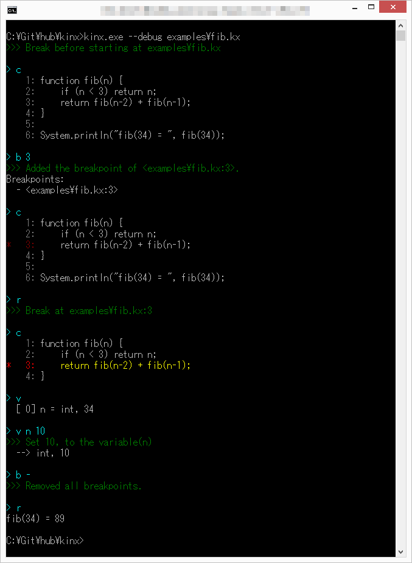

# Kinx Debugger

## Debugger

Kinx Debugger is available and included in the Kinx itself.
The main features are followings.

* Set/Remove Breakpoints.
* Show Frames and Variables, and possible to change a variable value if you need.
* Show a current source code with breakpoints.
* Stepwise execution.

See the example below.
The commands and messages are colored to see easily, but note that there is no color in this document because it is Markdown text.



## Commands

### Run the Script with Debugger

Run it with `--debug` option, and the script will automatically be stopped before your code.
By the way, the line number of the starting point is '0' but it is no sense.

```
$ kinx --debug script.kx
>>> Break at script.kx:0

> 
```

### Debugger Commands

| Category  |    Command    |                Meaning                 |               Section               |
| --------- | ------------- | -------------------------------------- | ----------------------------------- |
| Common    | `h` or `help` | Display the help.                      | &#8594; [Help](#help)               |
| Flow      | `n`           | Run to the next line.                  |                                     |
|           | `r`           | Run to the next breakpoint.            |                                     |
|           | `b`           | Show breakpoints.                      | &#8594; [Breakpoints](#breakpoints) |
|           | `b [L]`       | Toggle the breakpoint to the line [L]. | &#8594; [Breakpoints](#breakpoints) |
|           | `b -`         | Remove all breakpoints.                | &#8594; [Breakpoints](#breakpoints) |
| Frames    | `f`           |                                        |                                     |
|           | `l`           |                                        |                                     |
|           | `mf [N]`      |                                        |                                     |
|           | `ml [N]`      |                                        |                                     |
| Variables | `v`           |                                        |                                     |
|           | `vf [N]`      |                                        |                                     |
|           | `vl [N]`      |                                        |                                     |
| Stack     | `s`           |                                        |                                     |

## Features

### Help

Use the command of `h`.

```
> h
Kinx Debugger version 0.1.0

[Common]
  h, help               Display this help.

[Flow]
  n                     Run to the next line.
  r                     Run to the next breakpoint.
  b                     Show breakpoints.
  b [L]                 Toggle the breakpoint to the line [L].
  b -                   Remove all breakpoints.

[Frames]
  f                     Show a frame list on the stack.
  l                     Show a lexical frame list of a current frame.
  mf [N]                Move a current frame to the specified stack frame.
  ml [N]                Move a current frame to the specified lexical frame.

[Stack]
  s                     Show the stack with the first 10 entries.
  s all                 Show the stack all.

[Veriables]
  v                     Show variables in a current frame.
  vf [N]                Show variables of [N]th frame on the stack.
  vl [N]                Show variables of [N]th lexical frame.
  v [Name]              Show details of a variable in a current frame.
  v [Name] [Val] [Type] Set the value to a variable in a current frame.
                        Name: Variable name with index or property name.
                              ex) name, name.prop[1].next
                        Type: i ... int
                              d ... dbl
                              s ... str
                              * auto detect by [Val] if not specified.

[Source Code]
  c                     Show a source code of a current function.
  c all                 Show all of a current source code.
  d                     Dump an IR code of a current function.
```

### Breakpoints

Use the command of `b`.

#### `b`

To use only the command `b` means to show all breakpoints.

```
> b
Breakpoints:
  - <script.kx:1>
  - <script.kx:2>
  - <script.kx:3>
```

#### `b [L]`

The command `b` with [L] as a line number means to toggle a breakpoint.
If the breakpoint to that line number has been already set, the breakpoint will be removed.
If it hasn't been set, the breakpoint will be set.

```
> b
>>> No breakpoints.

> b 3
>>> Added the breakpoint of <script.kx:3>.
Breakpoints:
  - <script.kx:3>

> b 2
>>> Added the breakpoint of <script.kx:2>.
Breakpoints:
  - <script.kx:2>
  - <script.kx:3>

> b 2
>>> Removed the breakpoint of <script.kx:2>.
Breakpoints:
  - <script.kx:3>

> b
Breakpoints:
  - <script.kx:3>
```

#### `b -`

The command `b -` means to remove all breakpoints.

```
> b
Breakpoints:
  - <script.kx:1>
  - <script.kx:2>
  - <script.kx:3>

> b -
>>> Removed all breakpoints.

> b
>>> No breakpoints.
```

### Frames and Variables

You can show frames as a call stack, and also show lexical frames.
The features are followings.

* Show frames as a call stack.
* Show lexical frames of a current frame.
* Move a current frame.
* Show variables in a frame.
* Change a value of a variable in a current frame.

#### `f`

Show the frames as a call stack.

```
> f
 [*] [  54] fib (examples\fib.kx:3)
  -  [  49] fib (examples\fib.kx:3)
  -  [  44] fib (examples\fib.kx:3)
  -  [  39] fib (examples\fib.kx:3)
  -  [  34] fib (examples\fib.kx:3)
  -  [  29] fib (examples\fib.kx:3)
  -  [  24] fib (examples\fib.kx:3)
  -  [  19] fib (examples\fib.kx:3)
  -  [  14] fib (examples\fib.kx:3)
  -  [   9] fib (examples\fib.kx:3)
  -  [   4] <main-block> (examples\fib.kx:6)
```

#### `l`

Show lexical frames.

```
> l
 [*] [  54] fib (examples\fib.kx:3)
  -  [   4] lexical frame
```

### `v`

Show the variables of the current frame.

```
> v
  [ 0] n = int, 16
```

### `f [N]`


### Source Code

### Stepwise Execution

## Examples
