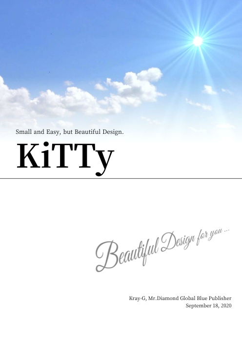
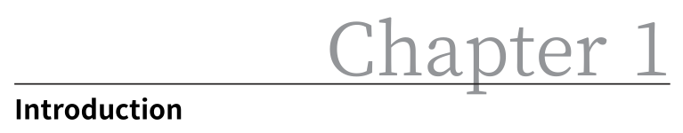

% KiTTy
% Kray-G, Mr.Diamond Global Blue Publisher
% September 18, 2020

Small and Easy, but Beautiful Design.

<param style="BookA4"/>
<param multibytefont="jp"/>
<param titleSize="78.8"/>
<param subtitleSize="14.4"/>
<param backgroundImage="back.jpg"/>

<!-- style-info name="chapter.style" value="BigChapter3" /-->

<toc with="lof,lot"/>

# Introduction

First, this section introduces a KiTTy itself and shows a comparison to alternative softwares,
and introduces a value of KiTTy and use case of KiTTy.
And also, it shows supported features.

## What is KiTTy

**KiTTy** means **Ki**nx **T**iny **Ty**pesetting,
which is a simple typesetting system implemented by Kinx.
It also provides a translator from Markdown,
then you can typeset a Markdown document and can get a beautiful document.
This document itself is also the example typeset by this system.

The objective is similar to \\LaTeX, it is an objective to typeset beautifully for a document managed as a text file.
To be concretely, it is never going to be alternative,
but the objective is being more useful in the use case like your personal situation by followings.

*   Keeping a small system.
*   Pretty beautiful output.
*   Directly output as PDF file.

KiTTy is small but it has a simple feature to typeset it beautifully,
and it is a typesetting system to output PDF directly from Markdown document.

### Versus \\LaTeX

\\LaTeX is a huge system.
It is extendable, it is supported by many people, and it is a typesetting system which can make a beautiful document.
KiTTy is also a typesetting system which has a same objective as \\LaTeX,
but it is provided as a small system with limited features.

Being huge of \\LaTeX system causes a complexibility of an installation.
Besides, there are multiple distributions to provide many functionality of \\TeX and \\LaTeX.
That is the reason why people have to think first what distribution should be used.
Everybody can use KiTTy soon because KiTTy is included in Kinx as a standard library,

Only one cons point is that limited features[^1] are provided.
And also the compilation speed is *slow*.
It takes about 4 minutes to compile this document.
The performance is one of problems,
but this system is focusing what is used as a small and a personal use.

[^1]: About ''limited features'', see \\nameref{Features Overview}.

### Versus Word

The Word is a famous WYSIWYG[^2] Word Processor, but it is based on a different concept.
The word processor can edit a document as it shows, but it usually saves a document as a binary style.
Therefore, in general, you need an own software, which is ''Word'' in this case, to show its content.
With KiTTy, same as \\LaTeX, you can see its content directly because it is a text style, and can edit it with your familier editor.

[^2]: This means **W**hat **Y**ou **S**ee **I**s **W**hat **Y**ou **G**et.

Saving as a text, it can be processed easily by another software,
and also showing diff in a version control like Git is very easy.
This is quite important and a mandatory requirement, especially for the management of source code.
Besides, about the structure of a document,
it is difficult from its looking to distinguish if it is structured or not.
For example, you can not find its chapter number is correctly assigned,
and you can not find if it would corrected when you change a layout or a location of sentences.
In particular, there is a case sometimes you have met unlucky cases as someone has not set it up correctly.

The structure is clearly written in text style in KiTTy,
it can correctly realize to make a cross-reference, numbering a chapter number,
a figure number, a table number, and a page number.
Instead, it is a cons point not to show the document as it shows, like WYSIWYG.
You have to compile first to show the actual document to be typeset.

### Versus Vivliostyle

CSS Typesetting is based on the Web Technology,
and CSS Typesetting now has a most great future.
Therefore CSS Typesetting is recommended if you want to do typeset in earnest.
Especially Vivliostyle[^vivliostyle] is a very hopeful project.

[^vivliostyle]: https://vivliostyle.org/

As for KiTTy, it is important to be a small system and easy to use.
Although time will solve, CSS Typesetting is still making it standard in progress.
Therefore some of the specification has not been clarified yet,
and it is possible to assume it will be changed in future.
As this is a big project and making it standardized,
it will be a system to use in a real commercial use,
but the system itself will be getting huge.

Said again, a main point of view in KiTTy is a small and easy to use.

### Conclusion

If you want to use a typesetting system right now in a real earnest, you should use \\LaTeX.
If you want to study a typesetting system in the future and use it,
you had better use a CSS Typesetting like Vivliostyle.
Moreover, in sumerize, KiTTy will be useful in following situations.

*   Wants to use a small system, instead of the huge system like \\TeX.
*   Wants to manage a diff by a version control system like Git.
*   Wants to control the structure of a document and make a cross-reference correctly.

This system is provided to the person[^3] who think the \\TeX system is very huge as a system for creating a small document,
and who wants to manage the document as a text file.
In particular, if you want to manage a document and a diff by the system like Git,
it is quite difficult to manage it by Word which is realized by the style of WYSIWYG.
It is a main target of use cases not to manage by a word processor and not to use a huge system.

[^3]: This means the person like me. In fact, the first objective was to create a user manual of my own project.

## Supported Features

### Typesetting Features

KiTTy supports following features.
See ''\\nameref{Features Overview}'' for a concrete content of features.
By the way, kerning is not supported so far.

*   Hyphenation, justification, and line-breaking algorithm
*   Widows and Orphans
*   Multiple columns
*   Itemization
*   Math formula and equations
*   Image
*   Chart
*   Table
*   Font
*   Color
*   Ligature
*   Programming Code Block
*   Title, Cover Page, and Contents
*   Chapter and Section
*   Cross-Reference
*   Quotation
*   Footnote

### Typesetting Features in Japanese

KiTTy also supports following features for the own requirement in Japanese.
If you want to add any other languages,
I can not lead you because I am sorry I do not have any knowkedge for other languages.
As it has been  difficult to care about the extension point for other languages,
it might need to add a lot of features or many points of fixes.
But it will be possible to extend features because this is an open source.

*   Japanese hyphenation
*   Japanese Ruby like \\ruby\[how to read\]{Difficult Kanji}

### PDF Features

Although this is not available when it is printed on a paper, the following features are supported.

*   External Link by URL
*   Link by Cross-Reference
*   Bookmark

# Getting Started

This chapter introduces about preparing to start using KiTTy in practice
and how to use through simple examples.
By the way, there are differences about how to prepare between Windows and Linux,
but you can get a same result as long as you use prepared fonts in KiTTy.
Therefore you can use both without problems.

## Installation

There are 2 steps to install it.

1. Install Kinx
2. Install KiTTy package

### Linux

Download the following modules first on Linux.
The version `v0.15.2` is the version which includes KiTTy library officially.
When the latest version is different, rewrite the version number and do it.
Make the work directory and change the directory.

```console
$ mkdir temp
$ cd temp
```

Download Kinx module and extract it first,
and then download KiTTy package and extract it.

```console
$ curl -L \
    https://github.com/Kray-G/kinx/releases/download/v0.15.2/package_linux-amd64.tar.gz \
    --output package_linux-amd64.tar.gz
$ tar -xvf package_linux-amd64.tar.gz
$ curl -L \
    https://github.com/Kray-G/kinx/releases/download/v0.15.2/package_kitty.zip \
    --output package_kitty.zip
$ unzip package_kitty.zip
```

You will find the folder of the name of the version number,
and move into it and execute an `install.sh` command.

```console
$ cd v0.15.2
$ sudo ./install.sh
```

That is all for installation.
Let\\apos{}s confirm the location to be installed.

```console
$ which kxkitty
/usr/bin/kxkitty
```

### Windows

Download 2 latest modules from \\url\[https://github.com/Kray-G/kinx/releases\]{Release Page} when it is Windows.

*   package_win64.zip
*   package_kitty.zip

Extract each, and then copy files in `package_kitty.zip` to `lib` folder[^winbuild].

> \\noindent The `fonts` and `phantomjs` folder should be right under `lib` folder.
> Please note that the files in an archive file might not be that structure.

[^winbuild]: The installer for Windows is now not provided yet, but it will be prepared in the future.

## Build

You do not have to build it usually, you can use a prebuilt modules
following the procedure of ''\\nameref{Installation}''.
If you dare to build it, you can do it by the procedure as follows.

### Linux

Clone it from Github, and do `make`.

```console
$ git clone https://github.com/Kray-G/kinx.git
$ cd kinx
$ make
```

Install it.

```console
$ git clone https://github.com/Kray-G/kinx.git
$ cd kinx
$ sudo make install
$ sudo make kitty-install
```

### Windows

Clone it from Github, and do `make`.

```console
$ git clone https://github.com/Kray-G/kinx.git
$ cd kinx
$ make.cmd
```

Now no installer has been provided,
but you can use this system in the build environment.
Use the system in the build environment.

## hello, world

Create the following text and save it as the name of `helloworld.md`.

```markdown
% Hello Kinx Tiny Typesetting
% Your name
% October 7, 2020

<param style="ArticleA4"/>

# Greeting
hello, world
```

Execute `kxkitty` command as below, and `helloworld.pdf` will be generated.

```console
$ kxkitty helloworld.md
```

By the way, now you need write the document as above,
but I will plan that it can be a little more simple document.

# Features Overview

This chapter will explain the feature\\apos{}s overview.
As this document itself has been generated by this system,
you can realize all what this document realize.
Let\\apos{}s try various things first.

## Typesetting Features

### Hyphenation, Justification, and Line-Breaking Algorithm


This system supports a Hyphenation based on Franklin M. Liang algorithm.
And also this supports a justification with that hyphenation algorithm.

Line-breaking is based on Knuth-Plass Line Breaking algorithm.
This algorithm is what is controlled by Box, Glue, and Penalty,
and it is same as the algorithm implemented in \\TeX.
These hyphenation and line-breaking argorithm are the well-known as the best practice in the typesetting so far.
Note that it is not all same as the output by \\TeX, because this is implemented by Kinx.

### Widows and Orphans

In some case, this system provides a part of a penalty control for Widows and Orphans.
Note that this is not perfect for all cases.
It is available for following cases.

*   Deterrent to put a section name to the bottom of page.
    *   In this case, a section name is moved to a next page.
*   Deterrent to put only a top line in a paragraph to the bottom of page.
    *   In this case, all lines in a paragraph is moved to a next page.
    *   When only a section name is put to the bottom of page as a result, a section name is also moved to the next page.
*   Deterrent to put only a last line in a paragraph to the top of a next page.
    *   In this case, last 2 lines are moved to a next page.

Those above mechanisms are automatically done.
You do not have to do anything in your document.
But those are not perfect for all cases,
therefore use `<pagebreak />` command when you feel it is not good layout,
and you can insert a page break there.

<pagebreak/>

### Multiple columns

You can use multiple columns.
Write `<set-column value="N"/>`, and the document is set to N columns.
When you get back to only 1 column, use `<set-column value="1"/>`.
The line will be back to the top of a next column when the text is reached at the bottom of page.

You can set the column height with `height` parameter.
`height` parameter can be the value with unit like `10em`.
Writing `<set-column value="2" height="12em" />` will set 2 columns with the height of 12em.

About footnotes, it is not set each column.
footnotes are always set against total width of a page.
The following example is a part of *Alice\\apos{}s Adventures in Wonderland*[^alice] with 2 columns.

[^alice]: \\url\[https://en.wikipedia.org/wiki/Alice%27s\_Adventures\_in\_Wonderland\]{Alice\\apos{}s Adventures in Wonderland - Lewis Carroll}

---

<set-column value="2" height="30em" />

\\font\[type=sans\]{\\bold{\\noindent CHAPTER I. Down the Rabbit-Hole}}

\\noindent Alice was beginning to get very tired of sitting by her sister on the
bank, and of having nothing to do: once or twice she had peeped into
the book her sister was reading, but it had no pictures or
conversations in it, ''and what is the use of a book,'' thought Alice
''without pictures or conversations?''

So she was considering in her own mind (as well as she could, for the
hot day made her feel very sleepy and stupid), whether the pleasure of
making a daisy-chain would be worth the trouble of getting up and
picking the daisies, when suddenly a White Rabbit with pink eyes ran
close by her.

There was nothing so VERY remarkable in that; nor did Alice think it
so VERY much out of the way to hear the Rabbit say to itself, ''Oh
dear\! Oh dear\! I shall be late\!'' (when she thought it over afterwards,
it occurred to her that she ought to have wondered at this, but at the
time it all seemed quite natural); but when the Rabbit actually TOOK A
WATCH OUT OF ITS WAISTCOAT-POCKET, and looked at it, and then hurried
on, Alice started to her feet, for it flashed across her mind that she
had never before seen a rabbit with either a waistcoat-pocket, or a
watch to take out of it, and burning with curiosity, she ran across the
field after it, and fortunately was just in time to see it pop down a
large rabbit-hole under the hedge.

<set-column value="1"/>

---

The height is set to 30em here.
As the system does not automatically set the height,
you have to set it yourself one by one if you want to set the height.
The line is reached at the bottom of page,
the text will be back to the top of a next column automatically.
When you do not set the height,
the text will get back to the top of a next column automatically when it reached at the bottom of a page.

### Itemization

There are 2 types of itemization with a symbol and a number.
The following is an example of itemization with a symbol.

```
*   Level 1
    *   Level 2
        *   Level 3
            *   Level 4
```

This is formatted as follows.

*   Level 1
    *   Level 2
        *   Level 3
            *   Level 4

The next example is a numbered itemization.
The numbered for each item will be adjusted automatically.

```
1.  Level 1
    1.  Level 2
        1.  Level 3
            1.  Level 4
            1.  Level 4
```

This is formatted as follows.

1.  Level 1
    1.  Level 2
        1.  Level 3
            1.  Level 4
            1.  Level 4

It is possible to use both and mix it in the same list.
The next example is a mixed one.

```
*   Level 1
    1.  Level 2
        *   Level 3
            1.  Level 4
```

This is formatted as follows.

*   Level 1
    1.  Level 2
        *   Level 3
            1.  Level 4


### Math formula and equations

KiTTy includes \\KaTeX, and output Math formula and equations.
There are 2 styles of standalone style and inline style as an output style.

#### Standalone Style

When it is a standalone style, it is written as a Code Block with `Math` language.
This is shown in an independent line.

    ```math:label=Math1
    \begin{aligned}
        \int_{-\infty}^{\infty} f(x) dx &= \sqrt{\pi}
    \end{aligned}
    ```

For above, the output will be below.
It is not necessary to set the option of `label`,
but you can use \\ref{Math1} for the reference to Math equations
if you set the `label`.

```math:label=Math1
\begin{aligned}
    \int_{-\infty}^{\infty} f(x) dx &= \sqrt{\pi}
\end{aligned}
```

Note that `label` is supported not by \\KaTeX but by KiTTy.
Therefore you have to control `label` when there are 2 or more Math equations.

    ```math:label=Math2(0.2)/Math3(0.6)
    \begin{aligned}
        E &= mc^2 \\
        m &= \frac{m_0}{\sqrt{1-\frac{v^2}{c^2}}} \\
    \end{aligned}
    ```

For above, the label of Math2 and Math3 will be put at 20% and 60%
from the top of the location where the Math equations is.

```math:label=Math2(0.2)/Math3(0.6)
\begin{aligned}
    E &= mc^2 \\
    m &= \frac{m_0}{\sqrt{1-\frac{v^2}{c^2}}} \\
\end{aligned}
```

By this, writing `\ref{Math2}` creates the reference to the Math \\ref{Math2},
and writing `\ref{Math3}` creates the refenrence to the Math \\ref{Math3}.

#### Inline Style

When using inline Math, use `$` around the Math equations.
For example, writing `$E = mc^2$` shows $E = mc^2$.
And writing a symbol with height like integral, for example,
writing `$\\int\_{-\\infty}^{\\infty} f(x) dx = \\sqrt{\\pi}$` as the same equation as Math \\ref{Math1}
will show $\\int\_{-\\infty}^{\\infty} f(x) dx = \\sqrt{\\pi}$.
By the way, note that `\` and `_` have to be escaped because it is the same symbol of Markdown.

You can use `\\displaystyle` inside `$` if you want to use a large type of fomula.
For example, writing `$\\displaystyle\\int\_{-\\infty}^{\\infty} f(x) dx = \\sqrt{\\pi}$` shows
$\\displaystyle\\int\_{-\\infty}^{\\infty} f(x) dx = \\sqrt{\\pi}$.
But anyway it is not recommended because the height is different and not beautiful.

### Image

For Image, you can use a Markdown syntax for Image as is,
but the option will be written in the position of `alt`,
and then the syntax will be the style of ``.
It is possible to insert an image as a standalone style,
an inline style, and a floating style.

#### Standalone Image

To show a standalone image, write it as an independent paragraph between blank lines.

```:lineNumber=false

```

For above, the image will be inserted as below.
The image width is adjusted to 60% for the page width by the option of `scale=0.6`.
The ratio of width and height is stayed.


#### Inline Image

Here is an example of inline style.
When inserting an image as inline style,
you write it directly inside text like the following.

```:lineNumber=false
The file icon is changed to .
```

In this case, ''The file icon is changed to .'' will appear.
You have to adjust `scale` and `offsetY` according to the original size of image.

#### Floating Image

To float an image, use `float=left` or `float=right` to the option.
The image of ''\\nameref{image1}'' at the page of \\pageref{image1} is one of example of this.


The picture on the left is provided as a Public Domain[^4].
The image is located as a floating image like this.
The option of `scale` can be used with a floating image,
but its size is limited within 70%[^5] of the area wthout margins.

[^4]: https://free-images.com/
[^5]: The margin between an image and a text is included in this 70%.

And also, you can write multiple paragraphs around a floating image.
When a text of a paragraph is finally reached at the bottom of a floating image,
the text width of a line will be automatically back to the width of the page,
and the text is located around a image naturally.


In this case, the right picture is an example of a floating image which is located to the right of the text.
The image is also Public Domain as same as the above picture.

There is a note that the top of an image have to be set to the top of a paragraph.
You can not put an image inside a paragraph.
If there is an image you want to float when some paragraph starts,
the image will be located to the left or right which you specified when paragraph starts.

#### Image Options

You can use options as follows.

<context label="Table:ImageOptions"/>
<context caption="Image Options"/>

|  Option   |                    Value                    |                                                 Meaning                                                 |
| --------- | ------------------------------------------- | ------------------------------------------------------------------------------------------------------- |
| `float`   | `left`, `right`                             | A location of a floating image.                                                                         |
| `scale`   | 0.0 ～ 1.0                                  | A scale against the area between margins.                                                               |
| `caption` | Text                                        | A caption of an image.                                                                                  |
| `box`     | `BOX_NORMAL`<br/>`BOX_THIN`<br/>`BOX_THICK` | Output a box with a normal line.<br/>Output a box with a thin line.<br/>Output a box with a thick line. |
| `padding` | Real number                                 | The margin between an image and a text.                                                                 |

### Chart

Chart is also supported.
It supports both a stanalone style and a floating style.

#### Standalone Chart

For a standalone style of chart, use a Code Block with the language of `chart`.
For example, it is written in JSON structure as below.
In addition to chart information like `width` and `height`,
Chart.js[^ChartJs] data itself have to be put in the field of `options`.

[^ChartJs]: https://www.chartjs.org/

    ```chart
    {
        width: 800,
        height: 400,
        fontSize: 16,
        scale: 1.0,
        caption: "Radar Chart Example",
        options: {
            type: "radar",
            data: {
                labels: [["Eating", "Dinner"], ["Drinking", "Water"],
                    "Sleeping", ["Designing", "Graphics"],
                    "Coding", "Cycling", "Running"],
                datasets: [{
                    label: "My First dataset",
                    backgroundColor: "rgba(255, 0, 0, 0.2)",
                    borderColor: "red",
                    pointBackgroundColor: "red",
                    data: [ 10.1, 80.0, 72.2, 73.3, 55.0, 68.5, 92.0 ]
                }, {
                    label: "My Second dataset",
                    backgroundColor: "rgba(0, 0, 255, 0.2)",
                    borderColor: "blue",
                    pointBackgroundColor: "blue",
                    data: [ 30.9, 77.1, 49.9, 50.0, 67.8, 71.0, 22.8 ]
                }]
            },
            options: {
                legend: {
                    position: "top",
                },
                scale: {
                    ticks: {
                        beginAtZero: true
                    }
                }
            }
        }
    }
    ```

This will be shown as \\nameref{Fig:RadarExample}.

```chart
{
    width: 800,
    height: 400,
    fontSize: 16,
    scale: 1.0,
    label: "Fig:RadarExample",
    caption: "Radar Chart Example",
    options: {
        type: "radar",
        data: {
            labels: [["Eating", "Dinner"], ["Drinking", "Water"],
                "Sleeping", ["Designing", "Graphics"],
                "Coding", "Cycling", "Running"],
            datasets: [{
                label: "My First dataset",
                backgroundColor: "rgba(255, 0, 0, 0.2)",
                borderColor: "red",
                pointBackgroundColor: "red",
                data: [ 10.1, 80.0, 72.2, 73.3, 55.0, 68.5, 92.0 ]
            }, {
                label: "My Second dataset",
                backgroundColor: "rgba(0, 0, 255, 0.2)",
                borderColor: "blue",
                pointBackgroundColor: "blue",
                data: [ 30.9, 77.1, 49.9, 50.0, 67.8, 71.0, 22.8 ]
            }]
        },
        options: {
            legend: {
                position: "top",
            },
            scale: {
                ticks: {
                    beginAtZero: true
                }
            }
        }
    }
}
```

#### Floating Chart

A floating chart is also supported as same as an Image.

```chart
{
    float: { right: true },
    width: 480,
    height: 300,
    scale: 0.4,
    caption: "Line Chart Example",
    options: {
        type: "line",
        data: {
            labels: ["Jan", "Feb", "Mar", "Apr", "May", "Jun", "Jul"],
            datasets:[{
                lineTension: 0,
                label: "Line A",
                data: [ 10.9, 32.8, 44.1, 56.9, 78.3, 64.2, 91.2],
                backgroundColor: "rgba(0, 0, 255, 0.2)",
                borderColor: "rgb(0, 0, 255)",
                borderWidth: 1
            }]
        },
        options: {
            legend: {
                labels: {
                    fontColor: "#0000ff"
                }
            }
        }
    }
}
```

You can set `float: { right: true }` to the option,
the chart will be floated and the next paragraph will be located around that chart.

In this case, it is a line chart.
`scale` means a width against the area without margins as same as an image.
You can put the caption for both a standalone style and a floating style,
and a chart will inserted to the document as an image.
This caption will be shown in the List Of Figures when setting to output Table Of Contents.
And also it is same as an floating image, a paragraph is naturally located under the chart.

The following is an example of the code.
By the way, in this time `options` is omitted due to space limitations,
but the `options` means the option of Chart.js.

    ```chart
    {
        float: { right: true },
        width: 480, height: 300, scale: 0.4, caption: "Line Chart Example",
        options: {
            type: "line",
            ...(omitted)
        }
    }
    ```

### Table

#### Markdown Table

Table is also supported.
The table can be written as a normal Markdown table, and the table is automatically generated.

For example, ''\\nameref{Table:ImageOptions}'' is written as below.
Use a `<context />` tag for the option which is not directly specified as a Markdown syntax.

    <context label="Table:ImageOptions"/>
    <context caption="Image Options"/>
    | Option  |      Value      |                  Meaning                  |
    | ------- | --------------- | ----------------------------------------- |
    | `float` | `left`, `right` | A location of a floating image.           |
    | `scale` | 0.0 ～ 1.0      | A scale against the area between margins. |

Using a normal Markdown syntax, you can make it centering, or aligning to the left or right.
Besides, you can use Math formula inside your table.
If the cell content becomes too long, you can use `<context cell-i-j="..." />` to write a long cell content.
In this case, $(i, j)$ means the location without a header.
For example, $(0, 0)$ means `A1` cell in the following table.
You see $i$ means a row number and $j$ means a column number.

    <context label="Table:TableExample"/>
    <context caption="Example of Table"/>
    <context vline-left="single"/>
    <context vline-right="single"/>
    <context vline-inside="single"/>
    <context hline-header="double"/>
    <context hline-inside="single"/>
    <context cell-2-1="$\displaystyle\int_{-\infty}^{\infty} f(x) dx = \sqrt{\pi}$"/>
    | Left |         Center         |         Right         |
    | :--- | :--------------------: | --------------------: |
    | A1   | Aligned to the center. | Aligned to the right. |
    | A2   |      Cell $(1,1)$      |      Cell $(1,2)$     |
    | A3   |           -            |      Cell $(2,2)$     |

Here is the output result below.

<context label="Table:TableExample"/>
<context caption="Example of Table"/>
<context vline-left="single"/>
<context vline-right="single"/>
<context vline-inside="single"/>
<context hline-header="double"/>
<context hline-inside="single"/>
<context cell-2-1="$\displaystyle\int_{-\infty}^{\infty} f(x) dx = \sqrt{\pi}$"/>

| Left |         Center         |         Right         |
| :--- | :--------------------: | --------------------: |
| A1   | Aligned to the center. | Aligned to the right. |
| A2   |      Cell $(1,1)$      |      Cell $(1,2)$     |
| A3   |           -            |      Cell $(2,2)$     |

#### Table Options

`<context />` tag can specify the parameters which can not be specified in a normal Markdown syntax.
''\\nameref{Table:TableOptions}'' shows the list of the parameters which can be specified for the table.
Those parameters are used as a temporary and they will be removed right after it being used.
Therefore the parameters specified once can not used for multiple tables.
You have to set it again if you want to use the same parameters for a next table.

But you can change a default value for the parameters except `label` and `caption`.
For that, change the value for the name with `-default` at the end of the parameter name.
For example, you can change the default value of `vline-left` by changing the value for `vline-left-default`.

<context label="Table:TableOptions"/>
<context caption="Table Options"/>
<context limit-column="0"/>

|      Name      |            Value            |                                                 Meaning                                                 |
| -------------- | --------------------------- | ------------------------------------------------------------------------------------------------------- |
| `label`        | Text                        | The label for Cross-Reference.                                                                          |
| `caption`      | Text                        | The caption of a table.                                                                                 |
| `vline-left`   | `single`, `double`, `false` | Vertical line type of the left on a table (`false` by default).                                         |
| `vline-right`  | Same as above               | Vertical line type of the right on a table (`false` by default).                                        |
| `vline-inside` | Same as above               | Vertical line type inside a table (`false` by default).                                                 |
| `hline-top`    | Same as above               | Horizontal line type of the top on a table (`single` by default).                                       |
| `hline-bottom` | Same as above               | Horizontal line type of the bottom on a table (`single` by default).                                    |
| `hline-header` | Same as above               | Horizontal line type under a header (`single` by default).                                              |
| `hline-inside` | Same as above               | Horizontal line type inside a table (`false` by default).                                               |
| `cell-i-j`     | Text                        | The text in the cell of $(i,j)$. $i$ is a row number and $j$ is a column number, and both are 0 origin. |
| `limit-column` | Integer number              | The column number for the minimum width to determine a cell width limitation.                           |
| `limit-width`  | Real number                 | The minimum width of a cell width.                                                                      |

### Font

#### Bold, Italic, BoldItalic

**Bold**, *Italic*, and ***BoldItalic*** is shown by a normal Markdown syntax.
Here is examples.

<context label="Table:FontShape"/>
<context caption="How to write Bold, Italic, and BoldItalic"/>

|      Markdown      |      Output      |
| ------------------ | ---------------- |
| `**Bold**`         | **Bold**         |
| `*Italic*`         | *Italic*         |
| `***BoldItalic***` | ***BoldItalic*** |

#### Use Fonts

If you want to use a font which is not loaded by default, load it by yourself, and you can use it.
The following shows how to load a font file.
It is necessary to specify 4 parameters separated by comma.

```
<font-load info="Name,type,shape,FileName.ttf" />
```

You can freely use the font after loading once.
The parameter meaning is as follows.

* `Name` is the own name of the font you can specify.
* `type` is a font type. It should be `serif`, `sans`, `monotype`.
* `shape` is a font shape. It should be `regular`, `bold`, `italic`, or `bolditalic`.
    * `regular` means a normal shape used in the normal sentence.
    * `bold`, `italic`, and `bolditalic` is for the shape meant by that name.

Use `\font` command to change the font as a following example.
By the way, you have to escape `\` of a command name, `[`, and `]` like `\\`, `\[`, and `\]`
because it is a Markdown special character.
The following example shows how to use `Parisienne-Regular.ttf` font[^FontLoad].

[^FontLoad]: This TrueType font file is already included in the KiTTy package,
but it is not loaded by default.
Load it by yourself to use it.

```
<font-load info="Parisienne,serif,regular,Parisienne-Regular.ttf" />
- Changing the font is available only with a scope like
''\\font\[name=Parisienne\]{This is a pen.},''
and the font will be restored here.
```

This shows as below.
This is available inside a scope of `\font` command as you see in the following example.

<font-load info="Parisienne,serif,regular,Parisienne-Regular.ttf" />
- Changing the font is available only with a scope like
''\\font\[name=Parisienne\]{This is a pen.},''
and the font will be restored here.

#### Font Size (Direct)

Font size is specified by `size` parameter of `\font` command.

```
''After this, the font size will be \\font\[size=7pt\]{shrink to 7pt}.
And after this, the font size will be \\font\[size=15pt\]{extend to 15pt}.''
will be shown.
And also, for example, `\font[size=1.2em]{1.2 times larger size}` shows
\\font\[size=1.2em\]{1.2 times larger size} will be shown.
```

''After this, the font size will be \\font\[size=7pt\]{shrink to 7pt}.
And after this, the font size will be \\font\[size=15pt\]{extend to 15pt}.''
will be shown.
And also, for example, `\font[size=1.2em]{1.2 times larger size}` shows
\\font\[size=1.2em\]{1.2 times larger size} will be shown.

You can use the unit of size as you see in the above example.
The unit you can specified is as follows.

<context label="Table:FontSizeUnit"/>
<context caption="Unit for Font Size"/>

| Unit |                            Meaning                            |
| ---- | ------------------------------------------------------------- |
| `em` | Relative size based on the current font size.                 |
| `ex` | Relative size based on the x height at the current font size. |
| `px` | By Pixel.                                                     |
| `pt` | By Point.                                                     |
| `pc` | By Pica, which means 1/6 inch.                                |
| `mm` | By Millimeter.                                                |
| `cm` | By Centimeter.                                                |
| `in` | By Inch.                                                      |

#### Font Size (Relative)

Use `\bigger`, `\smaller` to change the size with a relative size.
The size will be changed by +1 point for `\bigger` or -1 point for `\smaller` inside its scope.

```
This is an example of `\bigger`.
\\bigger{This is, \\bigger{this is, \\bigger{this is} a sentence,} a sentence}.
For `\smaller`,
\\smaller{This is, \\smaller{this is, \\smaller{this is} a sentence,} a sentence}.
```

This is an example of `\bigger`.
\\bigger{This is, \\bigger{this is, \\bigger{this is} a sentence,} a sentence}.
For `\smaller`,
\\smaller{This is, \\smaller{this is, \\smaller{this is} a sentence,} a sentence}.

### Color

#### Text Color

Use `\color` to change the text color.
Here are examples below.

```
*   \\color\[red\]{\\bold{Red}.
    This line should be colored by the name of `red`.}
*   \\color\[green\]{\\bold{Green}.
    This line should be colored by the name of `green`.}
*   \\color\[blue\]{\\bold{Blue}.
    This line should be colored by the name of `blue`.}
*   \\color\[cyan1\]{\\bold{Cyan}.
    This line should be colored by the name of `cyan1`.}
*   \\color\[magenta1\]{\\bold{Magenta}.
    This line should be colored by the name of `magenta1`.}
*   \\color\[yellow\]{\\bold{Yellow}.
    This line should be colored by the name of `yellow`.}
*   \\color\[R=0,G=64,B=255\]{\\bold{RGB}.
    This line should be colored by RGB value of `RGB=0,64,255`.}
*   \\color\[C=0.5,M=0.8,Y=0.2,K=0.0\]{\\bold{CMYK}.
    This line should be colored by CMYK value of `CMYK=0.5,0.8,0.2,0.0`.}
```

*   \\color\[red\]{\\bold{Red}.
    This line should be colored by the name of `red`.}
*   \\color\[green\]{\\bold{Green}.
    This line should be colored by the name of `green`.}
*   \\color\[blue\]{\\bold{Blue}.
    This line should be colored by the name of `blue`.}
*   \\color\[cyan1\]{\\bold{Cyan}.
    This line should be colored by the name of `cyan1`.}
*   \\color\[magenta1\]{\\bold{Magenta}.
    This line should be colored by the name of `magenta1`.}
*   \\color\[yellow\]{\\bold{Yellow}.
    This line should be colored by the name of `yellow`.}
*   \\color\[R=0,G=64,B=255\]{\\bold{RGB}.
    This line should be colored by RGB value of `RGB=0,64,255`.}
*   \\color\[C=0.5,M=0.8,Y=0.2,K=0.0\]{\\bold{CMYK}.
    This line should be colored by CMYK value of `CMYK=0.5,0.8,0.2,0.0`.}

See \\nameref{Color Examples} about supported color names.

### Ligature and Special Character

#### Ligature

Now the following 5 ligatures is only supported.

* f{}i ... fi
* f{}l ... fl
* f{}f ... ff
* f{}f{}i ... ffi
* f{}f{}l ... ffl

#### '' and\\hs{}''

both '' and\\hs{}'' are automatically replaced by writing 2 single quotes.

```
This is an ''example'' of double-quote.
```

This is an ''example'' of double-quote, will be shown.

#### Backquote

You can use a special command
because backquote is same as a special character in Markdown.
For this purpose, the special tag of `<backqN />` where `N` is the number of backquote can be used.
Write `<backq3 />` to show <backq3 />, and write `<backq2 />` to show <backq2 />.
If you want to use `Mototype`, you can use `<monotype-backqN />`.

### Programming Code Block

#### Code Block

Programming Code is written as a Code Block.
It shows with a line number and a shadow box by default.

    ```
    class Test {
        public test() {
            # Test Method.
        }
    }
    ```

Above example will show the following code[^ProgramCodeBox1]。

[^ProgramCodeBox1]: It is hard to distinguish those because of the same style,
but the code with <monotype-backq3 /> is the example to write.

```
class Test {
    public test() {
        # Test Method.
    }
}
```

Write the following to erase a line number and to be without a shadow.

    ```:lineNumber=false,box=BOX_NORMAL
    class Test {
        public test() {
            # Test Method.
        }
    }
    ```

Here is the result.

```:lineNumber=false,box=BOX_NORMAL
class Test {
    public test() {
        # Test Method.
    }
}
```

#### Code Block Option

##### Language Specified

Specified a language, a predefined functionality will be worked.
By the way, a language is specified right after <backq3 />, and use `:` as a separator for options.

| Language  |                                     Meaning                                      |
| --------- | -------------------------------------------------------------------------------- |
| `math`    | This means a Math syntax. See \\nameref{Math formula and equations} for details. |
| `chart`   | This means a Chart syntax. See \\nameref{Chart} for details.                     |
| `console` | A text color is white and a background color is black.                           |

##### lineNumber

Specify `true` or `false` to the `lineNumber` option.

##### box

The available values for the `box` option are as follows.

<context label="Table:CodeBoxOption"/>
<context caption="The available values for box"/>
<context limit-column="0"/>

|    Value     |                Meaning                 |
| ------------ | -------------------------------------- |
| `BOX_NORMAL` | Show a box with a normal line width.   |
| `BOX_THIN`   | Show a box with a thin line width.     |
| `BOX_THICK`  | Show a box with a thick line width.    |
| `BOX_SHADOW` | Show a box with a shadow. (by default) |

##### color/bgcolor

You can change a text color and a background color by `color` or `bgcolor`.
See \\nameref{Color Examples} for the colors you can specify.

### Title, Cover Page, and Contents

#### Title Information

KiTTy will automatically generate a title page, a cover page, and a table of contents.
The necessary parameters have to be set before the first chapter title.
The following example is the example of parameters used by this document.
A title, author, and date is set by `%` at the head of a line.
You should write only `%` for no information because its order can not be changed.
The paragraph right after the setting by `%` will be a sub title.

```
% KiTTy
% Kray-G, Mr.Diamond Global Blue Publisher
% September 18, 2020

Small and Easy, but Beautiful Design For You
```

#### Other Parameters for Title

About the other parameters for a title,
specify those by `<param />` tag before the first chapter title.
The following is the example in this document.

```
<param style="JBookA4"/>
<param titleSize="78.8"/>
<param subtitleSize="14.4"/>
<param backgroundImage="back.jpg"/>
```

The parameter which can be set depends on the style.
This example shows parameters which can be set in the `BookA4` style.
The meaning of each parameter is as follows.

*   This document will use the `BookA4` style.
*   The size of a title text is 78.8pt.
*   The size of a sub title text is 14.4pt.
*   The cover page will use the `back.jpg` for the background image.

#### Parameters for Table Of Contents

To set the following command, and the document will show a table of contents.
By `with` parameter, you can choose if the document will show a list of figures and a list of table[^loflot].

```
<toc with="lof,lot"/>
```

[^loflot]: Set `lof` for a list of figures, and `lot` for a list of tables.
If you want to show both, set it separated by comma like `lof,lot`.

#### Customize Style

There are default values of parameters for each style.
Use `<style-info />` tag to change those default vlues.
For example, write the tag like a following to change the chapter design.
See \\nameref{Chapter Design} for the chapter design.

```
<style-info name="chapter.style" value="BigChapter3" />
```

See \\nameref{Style Parameters} for details of style parameters which you can change.

### Heading

The heading like Chapter and Section will be shown by the line lead by `#` as a normal Markdown syntax.
Please look at the following.

<context label="Table:ChapterSection"/>
<context caption="Headings in Markdown"/>
<context limit-column="0"/>

| Symbol |     Meaning     |
| ------ | --------------- |
| `#`    | Chapter         |
| `##`   | Section         |
| `###`  | Sub Section     |
| `####` | Sub Sub Section |

The numbering for the above Headings will be automatically done,
and Cross-Reference (\\nameref{Cross-Reference}) will be available.
You can use a heading text as a label for Cross-Reference.

### Cross-Reference

Cross-Reference is supported.
The following list is the target which you can use for Cross-Reference.

<context label="Table:CrossReference"/>
<context caption="Command List for Cross-Reference"/>
<context limit-column="0"/>

|      Command      |                                       Shown Text                                       |
| ----------------- | -------------------------------------------------------------------------------------- |
| `\ref{label}`     | A chapter number, a section number, a figure and table number, or Math formula number. |
| `\textref{label}` | The text for a label.                                                                  |
| `\nameref{label}` | ''Number and Text'' for a label.                                                       |
| `\pageref{label}` | The page number for a label.                                                           |

If the reference appears before an actual source of the reference, it can not be solved.
In that case, re-run KiTTy to solve the reference.

### Quotation

Quotation will be shown by '`>`' at the head of a line.
This is also a normal Markdown syntax.
You can not use the paragraph commands (\\nameref{Paragraph Commands}) of Markdown,
but the inline commands (\\nameref{Inline Commands}) and KiTTy commands (\\nameref{KiTTy Commands})
are available in a quotation syntax.
And nesting a quotation syntax is also available.
In that case, each quoted text is always recognized as a paragraph.
If you do not want to do indentation, use `\\noindent` command at the head of paragraph.
For example, here is an example of the introduction of this document.

```
> **KiTTy** means **Ki**nx **T**iny **Ty**pesetting,
> which is a simple typesetting system implemented by Kinx.
> > \\noindent It also provides a translator from Markdown,
> > then you can typeset a Markdown document and can get a beautiful document.
> > This document itself is also the example typeset by this system.
> 
> The objective is similar to \\LaTeX, it is an objective to typeset beautifully for
> a document managed as a text file.
```

The result is as below.

> **KiTTy** means **Ki**nx **T**iny **Ty**pesetting,
> which is a simple typesetting system implemented by Kinx.
> > \\noindent It also provides a translator from Markdown,
> > then you can typeset a Markdown document and can get a beautiful document.
> > This document itself is also the example typeset by this system.
> 
> The objective is similar to \\LaTeX, it is an objective to typeset beautifully for
> a document managed as a text file.

### Footnote

Footnote is also supported.
A footnote is the style of `[^label]` in Markdown.
Write the actual footnote text by the style of `[^label]: ...` in the independent paragraph.
For example, see the example below.

```
This is a footnote[^f1] in this paragraph.

[^f1]: This is a footnote text.
```

Here is a result, ''This is a footnote[^f1] in this paragraph.''
You will see the footnote will be shown at the bottom of this page.

[^f1]: This is a footnote text.

## Typesetting Features in Japanese

This is only for Japanese requirements.
If you do not need this section, skip and go to the next section of \\nameref{PdfFeatures}.

### Japanese Hypenation

The following Japanse hyphenation is now supported.

*   A line head Japanese hyphenation processing.
*   A line end Japanese hyphenation processing.
*   Line breaking is prohibited in a group ruby.

### Japanese Furigana
#### About Japanese Furigana

Japanese Furigana[^furigana] is supported.
Furigana is sometimes told as Ruby[^ruby].
Here is the specification.

[^furigana]: Furigana means syllabic characters to indicate pronunciation. To be simple, you can know how to read Kanji.
[^ruby]: It is also called ruby because the name of the 5.5-point size imported from England in the latter half of the 19th century was ruby.

*   The width is the longer width in a parent text and its ruby.
*   Both a mono ruby and a group ruby are supported.
*   Both Japanese and English can be used in both a parent text and its ruby.

This is only for Japanese requirement.
In Japanese, there is a way, which is named as ''Furigana'' or ''Ruby'', to write a text.
It is to write a small text as a way to read on the top of a main sentence.
For example, it is used like ''この\\ruby\[ほん\]{本}はとても\\ruby\[おもしろ\]{面白}いです,''
means ''This book is very interesting.''
Usually, very young children can\\apos{}t read Kanji.
And even if it were adults, there is a case they can\\apos{}t read a difficult Kanji or the Kanji they do not use usually.
Considering those cases, Furigana is used like ''\\ruby\[ほん\]{本}.''

#### How To Use Furigana

KiTTy supports 2 types of Furigana as a mono ruby and a group ruby.
When it is a mono ruby, write '`|`' as a separator like `\\ruby\[す|てき\]{素敵}`.
In this case, it shows ''\\ruby\[す|てき\]{素敵}'' and you will see the small words on each Kanji.
On the other hand, when it is a group ruby, write `\\ruby\[すてき\]{素敵}` without '`|`'.
In this case, it shows ''\\ruby\[すてき\]{素敵}'' and you will see the small words are aligned at both ends in the entire kanji.
You can see ''て'' is a center between ''素'' and ''敵'' at the example.
Besides, line breaking is prohibited in a group ruby, but it is allowed in a mono ruby.
By the way, ''素敵'' means ''wonderful.''

#### Furigana Examples

The following text is a beginning part of *The Spider\\apos{}s Thread*[^spider] from Ryunosuke Akutagawa.
It is shown as block quote style for easy to read.
First, it is an example of a group ruby.

[^spider]: \\url\[https://en.wikipedia.org/wiki/The\_Spider%27s\_Thread\]{The Spider\\apos{}s Thread - Ryunosuke Akutagawa}

```
> \\noindent ある日の事でございます。\\ruby\[おしゃかさま\]{御釈迦様}は
> 極楽の\\ruby\[はすいけ\]{蓮池}のふちを、
> 独りでぶらぶら御歩きになっていらっしゃいました。
```

Here is the result.

> \\noindent ある日の事でございます。\\ruby\[おしゃかさま\]{御釈迦様}は
> 極楽の\\ruby\[はすいけ\]{蓮池}のふちを、
> 独りでぶらぶら御歩きになっていらっしゃいました。

Next, it is an example of a mono ruby.
When it is a mono ruby, insert '`|`' as a separator.

```
> \\noindent ある日の事でございます。\\ruby\[お|しゃ|か|さま\]{御釈迦様}は
> 極楽の\\ruby\[はす|いけ\]{蓮池}のふちを、
> 独りでぶらぶら御歩きになっていらっしゃいました。
```

Here is the result.
You can see that the position of a ruby of ''おしゃかさま'' for ''御釈迦様'' is different.
The position of ''はすいけ'' for ''蓮池'' is same,
but the line break can be inserted between ''蓮'' and ''池'' as it is a mono ruby.

> \\noindent ある日の事でございます。\\ruby\[お|しゃ|か|さま\]{御釈迦様}は
> 極楽の\\ruby\[はす|いけ\]{蓮池}のふちを、
> 独りでぶらぶら御歩きになっていらっしゃいました。

## \\label\[PdfFeatures\]{PDF Features}

### External Link by URL

Write a URL directly to generate an external link for URL automatically.
For example, write `https://github.com/Kray-G/kinx` to generate the link to https://github.com/Kray-G/kinx on the URL text itself automatically.

The Markdown syntax as `[Link Text](URL)` is also supported.
Only one line style is supported, but a separated style like `[Text][ref]` with URL on another line is not supported.
For example, write `[Kinx](https://github.com/Kray-G/kinx)` to show [Kinx](https://github.com/Kray-G/kinx),
and you can click the link text to jump to the external web site.
In this case, you can click [Kinx](https://github.com/Kray-G/kinx).

### Link by Cross-Reference

As a document a Cross-Reference (\\nameref{Cross-Reference}) is supported,
and the internal link will be generated for that as a PDF document.
You can click that link to jump to the related document place like headings, figures, or tables.

### Bookmark

PDF bookmark is also supported.
The link for each heading is automatically generated as a PDF bookmark.
Click the heading on the bookmark, and you can jump there.

Note that PDF link text can not include any commands like KiTTy command.
Therefore do not use any command in the heading text name[^exc:section].

[^exc:section]: As excepted, only \\TeX, \\LaTeX, and \\KaTeX are replaced by the plain text of `TeX`, `LaTeX`, and `KaTeX`.

# Command Details

This chapter will describe available commands. As a command type,
roughly there are 2 types of commands as Markdown command or KiTTy command. And also in Markdown commands,
there are 3 types as a normal Markdown syntax, HTML, and a special command for KiTTy.
KiTTy commands are basically used in a paragraph, but the command will start with `\` symbol and will use `\[` and `\]`.
Therefore you have to use `\\` instead of '`\`' like ''`\\command\[\]`'' style because those symbols are
a specal character in Markdown to be an escape character.

## Markdown Commands

### Paragraph Commands

KiTTy will basically use a normal Markdown syntax,
but there is a case the syntax has an own condition.
See the table below.

<context label="Table:MarkdownParagraph"/>
<context caption="Markdown Paragraph Commands"/>
<context limit-column="0"/>

|  Markdown   |                                                       Syntax Detail                                                       |
| ----------- | ------------------------------------------------------------------------------------------------------------------------- |
| Paragraph   | Separated by blank line.                                                                                                  |
| Line Break  | Put double spaces at the end of line.                                                                                     |
| Code Block  | The line which is started with 4 spaces, or a paragraph between <backq3 />.                                               |
| Blockquote  | The line which is started with `'>'`.                                                                                     |
| Heading     | The line which is started with `'#'`. The style of underline, which is `==` and `--` under the heading, is not supported. |
| Itemization | The line which is started with `'*'`, or the number like `1.` etc. Blank lines can not be included between items.         |
| Table       | Normal Markdown table is supported. Use `<context />` command for additional information for table.                       |
| Figure      | When there is only one line of `` in a paragraph. Otherwise it will be dealt with an inline command.           |
| Footnote    | The line which is started with ''`[^name]:`'' in a paragraph, and `name` is anything you can name.                        |

### Inline Commands

KiTTy will basically use a normal Markdown syntax also for inline commands,
but there is a case the syntax has an own condition.
See the table below.

<context label="Table:MarkdownInline"/>
<context caption="Markdown Inline Commands"/>
<context limit-column="0"/>

|   Purpose    |                                     Syntax                                      |
| ------------ | ------------------------------------------------------------------------------- |
| Italic       | The string wrapped between `'*'` and `'*'`.                                     |
| Bold         | The string wrapped between `'**'` and `'**'`.                                   |
| Bold Italic  | The string wrapped between `'***'` and `'***'`.                                 |
| Inline Code  | The string wrapped between <backq1 /> and <backq1 />.                           |
| Inline Image | Use `` style.                                                        |
| Link         | Automatically generated by URL. Now the style of `[...](...)` is not supported. |
| Footnote Tag | Write ''`[^name]`'' in a paragraph. `name` is anything you can name.            |

### HTML Commands

KiTTy will use some HTML tags as a command.
It is used mainly for setting a parameter and controling a typesetting without showing in the document.

<context label="Table:HtmlCommand"/>
<context caption="HTML Commands"/>
<context limit-column="0"/>

|      Command      |                                                                 Meaning                                                                  |
| ----------------- | ---------------------------------------------------------------------------------------------------------------------------------------- |
| `<toc />`         | To show a Table of Contnts. This have to be set before the first chapter. The value of `lot` and `lof` can be set to the `with` option.  |
| `<param />`       | To set an initial value of page. This have to be set before the first chapter.                                                           |
| `<context />`     | To set an additional parameter temporarily for some commands. The parameter depends on the command.                                      |
| `<clear-float />` | To clear floating setting and to stop wrapping around an image.                                                                          |
| `<pagebreak />`   | To insert a page break forcely, and to do processing of page break.                                                                      |
| `<set-column />`  | To set the number of column. The number of columns is set to `value` attribute, and column\\apos{}s height is set to `height` attribute. |
| `<style-info />`  | To change the parameter of a style. The parameter is set to `name` and `value` attribute.                                                |
| `<appendix />`    | To indicate the start of Apendix.                                                                                                        |

## KiTTy Commands

### Paragraph Scope Commands

Paragraph scope commands will do process the text inside `{}` as a paragraph.
The following table shows a description of commands.

<context label="Table:KiTTyCommandParagraph"/>
<context caption="Paragraph Scope Commands"/>
<context limit-column="0"/>

|      Command       |                                                              Meaning                                                              |
| ------------------ | --------------------------------------------------------------------------------------------------------------------------------- |
| `\bigger{}`        | To change the font size by +1pt.                                                                                                  |
| `\smaller{}`       | To change the font size by -1pt.                                                                                                  |
| `\bold{}`          | To set the font shape to bold. It can be also shown by enclosing a text by `**`.                                                  |
| `\itaric{}`        | To set the font shape to italic. It can be also shown by enclosing a text by `*`.                                                 |
| `\color[params]{}` | To change a color of a text. <br/>You can use a color name like `red`, `R=r,G=g,B=b`, or `C=c,M=m,Y=y,K=k`.                       |
| `\font[params]{}`  | To change a font information like `\font[size=1em]{}`.<br/>`size` ... to change the font size.<br/>`name` ... to change the font. |
| `\footnote{}`      | To generate a footnote. It can be also shown by `[^name]`.                                                                        |
| `\monotype{}`      | To set to use a non-proportional font.                                                                                            |
| `\raise[params]{}` | To change an offset of Y, and to move a text to upside. The offset is set by `height` attribute.                                  |
| `\lower[params]{}` | To change an offset of Y, and to move a text to downside. The offset is set by `height` attribute.                                |
| `\sans{}`          | To set to use Sans Serif.                                                                                                         |
| `\url[params]{}`   | To generate a link text. URL should be written in `params`. It is same as `[Text](URL)`                                           |

In the `{}` of all commands you can write a paragraph although just `{}` is written in above examples.
For example, if you write `\\sans{''This is Sans Serif Font.''}`, it will show \\sans{''This is Sans Serif Font.''}

### Standalone Commands

Standalone command will not process the text inside `{}` as a paragraph.
The text inside `{}` is used as one of parameters.
By the way you can omit both `[]` and `{}`,
but you have to insert a space or only `{}` to distinguish from a next word if necessary.
For example, you can write `\\noindent{}`.

<context label="Table:KiTTyCommandStandalone"/>
<context caption="Standalone Commands"/>
<context limit-column="0"/>

|          Command           |                                              Meaning                                              |
| -------------------------- | ------------------------------------------------------------------------------------------------- |
| `\TeX`                     | \\TeX logo will be shown.                                                                         |
| `\LaTeX`                   | \\LaTeX logo will be shown.                                                                       |
| `\KaTeX`                   | \\KaTeX logo will be shown.                                                                       |
| `\noindent`                | Indentation will be erased. The paragraph without indentation will be generated.                  |
| `\apos`                    | Apostrophe will be shown.                                                                         |
| `\hs`                      | A space, which width is the width of a small i, will be shown.                                    |
| `\hspace{width}`           | To change the X position by the value of `width`. To move to the right by a plus value.           |
| `\vspace{height}`          | To change the Y position by the value of `height`. To move to the down by a plus value.           |
| `\ref{label}`              | To generate a Cross-Reference with the number specified by `label`.                               |
| `\pageref{label}`          | To generate a Cross-Reference to the page specified by `label`.                                   |
| `\textref{label}`          | To generate a Cross-Reference with the text specified by `label`.                                 |
| `\nameref{label}`          | To generate a Cross-Reference with the number and the text specified by `label`.                  |
| `\pack{text}`              | To make it be recognized as no line breaking in `text`.                                           |
| `\ruby[Ruby]{Parent-Text}` | To show `Ruby` on the top of `Parent-Text`. For example of the left, \\ruby\[Ruby\]{Parent-Text}. |

# How To Extend Features

This chapter describe how to extend features in KiTTy.
However all information can not be described in this chapter,
and some other document will be provided in the future.
Now this describe only an outline of a rough way to extend and add features.

## Adding Style

### Document Style

The style definition file of a document will be stored to the following path when the install path is `$INSTALL`.

```:lineNumber=false
$INSTALL/lib/std/typesetting/style/additional/*.kx
```

The files here are loaded in no particular order, so styles cannot be related, for example, class inheritance.
The standard styles, which can be parent classes, are stored below.

```:lineNumber=false
$INSTALL/lib/std/typesetting/style/basic/*.kx
```

You can use the style just by placing a file under the folder of `additional`.
When adding it under `basic`, please note that you need to add the load process to the following file.

```:lineNumber=false
$INSTALL/lib/std/typesetting/style/Styles.kx
```

Therefore, you should normally add the style definition file under `additional`.

#### Style Definition File Example

Here is the example of `ArticleA4_2Cols` which is provided by default.

```
using typesetting.style.basic.ArticleA4;

namespace Typesetting {
namespace Style {

    class ArticleA4_2Cols : Typesetting.Style.ArticleA4 {
        @style.columns = 2;
    }

} # namespace Style
} # namespace Typesetting
```

The class name is the style name.
And the class have to be joining in the namespace of `Typesetting.Style`.
This example shows the class `ArticleA4_2Cols` is inherit from `ArticleA4` style,
and set the number of columns to be 2 columns.
The style of `ArticleA4` which is the base of all styles, are located to the path of `basic/ArticleA4.kx`.
The parameters that you can set are all described in that file.
Please see the file of `ArticleA4` to know what parameters you can set.

### Title Style

You can create a plug-in of title design.
It can be also an independent page as a cover page.
The style definition of a title page is placed as below.

```:lineNumber=false
$INSTALL/lib/std/typesetting/style/title/*.kx
```

In your document, use the following tag to change a style of a title.
The `yourstylname` means a file name without an extension of the style definition file,
when you follow how to create as described below.

```
<style-info name="title.style" value="yourstylename" />
```

#### Title Style Example

For example, please look at the definition of `StandardArticle`.

By `Typesetting.Style.Title[__FILE__.stem()]`, the property name will be the name without an extension.
And write it to add a function object which defines a title design to that property.

```
namespace Typesetting {
namespace Style {

    Typesetting.Style.Title[__FILE__.stem()]
        = function(info, context, core, title, opts) {
            # drawing a Title Design
        };

} # namespace Style
} # namespace Typesetting
```

See \\nameref{Title Design} about the pre-designed title style. 

### Chapter Style

You can also create a plug-in of a chapter design.
The chapter design definition file is placed to the foloowing path.

```:lineNumber=false
$INSTALL/lib/std/typesetting/style/chapter/*.kx
```

If you want to change the chapter style, use the following tag.
The `yourstylname` means a file name without an extension of the style definition file,
when you follow how to create as described below.

```
<style-info name="chapter.style" value="yourstylename" />
```

#### Chapter Style Example

For example, please look at the example of `StandardBook`.

By `Typesetting.Style.Chapter[__FILE__.stem()]`, the property name will be the name without an extension.
And write it to add a function object which defines a chapter design to that property.

```
namespace Typesetting {
namespace Style {

    Typesetting.Style.Chapter[__FILE__.stem()]
        = function(info, context, core, text, opts) {
            # drawing a Chapter Design
        };

} # namespace Style
} # namespace Typesetting
```

See \\nameref{Chapter Design} about the pre-designed chapter style. 

## Hyphenation Rules

### Add The Rule

The rule file is stored under the following path.
By the way, the rule for Japanese is absolutely same as the rule for English,
because it is no differences between them.

```:lineNumber=false
$INSTALL/lib/std/typesetting/lang/*.kx
```

If you want to change the chapter style, use the following tag.
The `yourprocname` means a file name without an extension of the style definition file,
when you follow how to create as described below.

```
<style-info name="hyphenationRule" value="yourprocname" />
```

By `Typesetting.insertGlue[__FILE__.stem()]`, the property name will be the name without an extension.
And write it to add a function object which defines a process of hyphenation to that property.
For example, if the file name is `ja.kx`, `Typesetting.insertGlue.ja` will be defined.

```
Typesetting.insertGlue[__FILE__.stem()] = _function(info, Linebreak, wordlist, nodes) {
    # Hyphenation Rules

    wordlist.each { &(node, i):
        # ...
        nodes.push(Linebreak.Glue(0, Linebreak.Infinity, 0));
        nodes.push(Linebreak.Penalty(0, -Linebreak.Infinity, 0));
        nodes.push(node);
        # ...
    };
};
```

#### Create The Rule

`wordlist` as an argument is the list of words to be analyzed.
By its content, add a word object to a `nodes` array.
The following is the basic rule to add a node.

*   To prohibit a line break before the node, a Penalty with `Linebreak.Infinity` should be inserted before the node.

```
nodes.push(Linebreak.Penalty(0, Linebreak.Infinity, 0));
nodes.push(node);   # Target Node
```

*   To prohibit a line break after the node, a Penalty with `Linebreak.Infinity` should be inserted after the node.

```
nodes.push(node);   # Target Node
nodes.push(Linebreak.Penalty(0, Linebreak.Infinity, 0));
```

*   To do a line break before the node, the list will be as below.

```
nodes.push(Linebreak.Glue(0, Linebreak.Infinity, 0));
nodes.push(Linebreak.Penalty(0, Linebreak.Infinity, 0));
nodes.push(node);   # Target Node
```

*   To insert a Glue before the node, the Glue will be inserted as below.

```
nodes.push(Linebreak.Glue(width, stretch, shrink));
    # width ..... Width of Glue
    # stretch ... Maximum additional width limitation.
    # shrink .... Minimum shrinked width limitation.
nodes.push(node);   # Target Node
```

Finally, `nodes` will be a list including hyphenation rules.
Hyphenation will be done based on this information.

## Font

### Add New Font

If you want to add the font, place the font file at the following path.
By the way, only TrueType font is supported so far[^fontlimit].

```:lineNumber=false
$INSTALL/lib/fonts
```

[^fontlimit]: This is a limitation of libharu.

### Add System Font

If you want to use a system font provided by an operating system,
specify the file name of the font you want to use.
When doing so, a serch path is different between Windows and Linux.

<context label="Table:OSFonts"/>
<context caption="Font File Search Path"/>

|   OS    |         Search Path         |
| ------- | --------------------------- |
| Windows | `C:/Windows/Fonts`          |
| Linux   | `/usr/share/fonts/truetype` |

You can specify the file name as a relative path from above search path.
For example, when you want to use `Times New Roman` on Windows, do the following.

```
<font-load info="Times,serif,regular,times.ttf" />

* This is a Regular Style of a default font.
* \\font\[name=Times\]{Times New Roman of Regular Style}
```

The font information is embedded to a PDF file,
so the PDF file can be read and displayed correctly even on the other OS.
However, as a matter of course, note that if you use a font that can not be detected on a different OS,
the typesetting process itself will fail because the font can not be found.

## Commands

You can also add KiTTy commands.
KiTTy commands are located to the following path.

```:lineNumber=false
$INSTALL/lib/std/typesetting/command/inline/*.kx
$INSTALL/lib/std/typesetting/command/paragraph/*.kx
```

Standalone Commands (\\nameref{Standalone Commands}) are stored under `inline` folder,
and  Paragraph Scope Commands (\\nameref{Paragraph Scope Commands}) are stored under `paragraph` folder.

Put your additional command file, and you can use the new command automatically.
By the way, the file name seems to be a command name in almost all cases,
but the class name is actually used as a command name.
So far a class name and a file name is same in almost all commands.
A command is recognized when the name is absolutely matched or matched with a lower case.

### Define Standalone Commands

Here is the template for Standalone Commands.
It is necessary to implement an `exec` method.

Though `WordSet` object is returned in this case,
but you can return `Word` object, `LineBreak.Box` object, `LineBreak.Glue` object, `LineBreak.Penalty` object, or null.
You should return one of those if necessary.

```
namespace Typesetting {
namespace Command {

    class Command(info_, context_) {
        public exec(params) {
            var ws = new Typesetting.WordSet(info_);
            # ...
            return ws;
        }
    }

} # namespace Command
} # namespace Typesetting
```

<context label="Table:StandaloneKiTTyCommandObject"/>
<context caption="KiTTy Command Available Object Type"/>
<context limit-column="0"/>

|       Object        |                                            Meaning                                            |
| ------------------- | --------------------------------------------------------------------------------------------- |
| `WordSet`           | To return multiple words.                                                                     |
| `Word`              | To return a word.                                                                             |
| `LineBreak.Box`     | To return a Box instead of Word or WordSet. For example, use it when the text width is fixed. |
| `LineBreak.Glue`    | To insert a Glue.                                                                             |
| `LineBreak.Penalty` | To insert a Penalty.                                                                          |
| null                | Nothing to return when only changing the context, etc. This means no word in there.           |

### Define Paragraph Scope Commands

Here is the template for Paragraph Scope Commands.
The namespace is `ParagraphCommand` and it is different from Standalone Commands.
It is necessary to implement `start`, `end`, and `translate` method.
You do not need to implement if the method is not used.
If not implemented, KiTTy will just ignore it.

```
namespace Typesetting {
namespace ParagraphCommand {

    class Command(info_, context_) {
        public start() {
            # Procedure when started by `{`
        }
        public end() {
            # Procedure when ended by `}`
        }
        public translate(value) {
            # A paragraph between `{` and `}` is received as value.
            # value is an array of WordSet or something because this is called after
            # processing a paragraph.  If you want to translat from value to another
            # word set, do process it here.
            # This method is called before calling end().
        }
    }

} # namespace Command
} # namespace Typesetting
```

<appendix/>

# Pre-defined Designs

## Title Design

As a title design, there are 2 types of designs by default.

### StandardArticle

This is a title design for article.
The title is shown at the upside of a top page of a document.


### StandardBook



This will create an independent cover page.
This is the style used in this document.
It is available to set a sub title and a background image.

The image on the right is the example of the cover page of this document.
The sub title is shown on the top of the title text,
and there is underline under the title text.
The author and date is shown at the right side under the underline.
The other place is covered by the background image.
The background image is drawn from the top with the margin 0.

## Chapter Design

As a chapter design, there are 4 types of designs by default.

### StandardBook

This is the style used in this document.
This has a largish chapter number with an underline,
and put a bold type of a heading to the right side under the underline.


### BigChapter1

This style has a chapter number which is a little bigger than `StandardBook`,
and it changes the location of a number and a heading.



### BigChapter2

This style has a chapter number which is a little smaller than `StandardBook`,
and it puts a heading which is a little bigger with a regular font on the underline.


### BigChapter3

This style has a quite big chapter number and puts a heading with a regular font under the number.


# About Style Parameters

## Style Parameters

You can change the style parameters by `<style-info />`,
and it is specified by the format of `<style-info name="name" value="value" />`.
Here is the default value of the styles for an English document.

<context label="Table:StyleParameter"/>
<context caption="Style Parameter List"/>
<context limit-column="0"/>

|         Name          |      ArticleA4      |       BookA4        |
| --------------------- | :-----------------: | :-----------------: |
| `title.style`         | `"StandardArticle"` |  `"StandardBook"`   |
| `abstract.title.text` |    `"Abstract"`     |    `"Abstract"`     |
| `chapter.style`       |          -          |  `"StandardBook"`   |
| `hyphenationRule`     |       `"en"`        |       `"en"`        |
| `toc.header`          |    `"Contents"`     |    `"Contents"`     |
| `toc.lof`             | `"List Of Figures"` | `"List Of Figures"` |
| `toc.lot`             | `"List Of Tables"`  | `"List Of Tables"`  |
| `toc.appendix`        |    `"Appendix "`    |    `"Appendix "`    |
| `table.label`         |      `"Table"`      |      `"Table"`      |
| `image.label`         |       `"Fig"`       |       `"Fig"`       |
| `image.fulllabel`     |     `"Figure"`      |     `"Figure"`      |

The parameters which you can change will be added in the future.

# Color Examples

## Color Names and RGB/CMYK Values

You can use the color names below with the `\color` command.
This table also shows a value of RGB and CMYK for the color name.

<context label="Table:ColorMap"/>
<context caption="Color Names and RGB/CMYK Values"/>

|     Color Name      |      RGB Value       |           CMYK Value           |             Color Example             |
| :------------------ | :------------------: | :----------------------------: | :-----------------------------------: |
| `aqua`              | `[0x00, 0xff, 0xff]` | `[1.000, 0.000, 0.000, 0.000]` | \\color\[aqua\]{■ Color}              |
| `aquamarine1`       | `[0x87, 0xff, 0xd7]` | `[0.471, 0.000, 0.157, 0.000]` | \\color\[aquamarine1\]{■ Color}       |
| `aquamarine3`       | `[0x5f, 0xd7, 0xaf]` | `[0.471, 0.000, 0.157, 0.157]` | \\color\[aquamarine3\]{■ Color}       |
| `black`             | `[0x00, 0x00, 0x00]` | `[0.000, 0.000, 0.000, 1.000]` | \\color\[black\]{■ Color}             |
| `blue`              | `[0x00, 0x00, 0xff]` | `[1.000, 1.000, 0.000, 0.000]` | \\color\[blue\]{■ Color}              |
| `blue1`             | `[0x00, 0x00, 0xff]` | `[1.000, 1.000, 0.000, 0.000]` | \\color\[blue1\]{■ Color}             |
| `blue3`             | `[0x00, 0x00, 0xd7]` | `[0.843, 0.843, 0.000, 0.157]` | \\color\[blue3\]{■ Color}             |
| `blueviolet`        | `[0x5f, 0x00, 0xff]` | `[0.627, 1.000, 0.000, 0.000]` | \\color\[blueviolet\]{■ Color}        |
| `cadetblue`         | `[0x5f, 0xaf, 0xaf]` | `[0.314, 0.000, 0.000, 0.314]` | \\color\[cadetblue\]{■ Color}         |
| `chartreuse1`       | `[0x87, 0xff, 0x00]` | `[0.471, 0.000, 1.000, 0.000]` | \\color\[chartreuse1\]{■ Color}       |
| `chartreuse2`       | `[0x87, 0xd7, 0x00]` | `[0.314, 0.000, 0.843, 0.157]` | \\color\[chartreuse2\]{■ Color}       |
| `chartreuse3`       | `[0x5f, 0xd7, 0x00]` | `[0.471, 0.000, 0.843, 0.157]` | \\color\[chartreuse3\]{■ Color}       |
| `chartreuse4`       | `[0x5f, 0x87, 0x00]` | `[0.157, 0.000, 0.529, 0.471]` | \\color\[chartreuse4\]{■ Color}       |
| `cornflowerblue`    | `[0x5f, 0x87, 0xff]` | `[0.627, 0.471, 0.000, 0.000]` | \\color\[cornflowerblue\]{■ Color}    |
| `cornsilk1`         | `[0xff, 0xff, 0xd7]` | `[0.000, 0.000, 0.157, 0.000]` | \\color\[cornsilk1\]{■ Color}         |
| `cyan1`             | `[0x00, 0xff, 0xff]` | `[1.000, 0.000, 0.000, 0.000]` | \\color\[cyan1\]{■ Color}             |
| `cyan2`             | `[0x00, 0xff, 0xd7]` | `[1.000, 0.000, 0.157, 0.000]` | \\color\[cyan2\]{■ Color}             |
| `cyan3`             | `[0x00, 0xd7, 0xaf]` | `[0.843, 0.000, 0.157, 0.157]` | \\color\[cyan3\]{■ Color}             |
| `darkblue`          | `[0x00, 0x00, 0x87]` | `[0.529, 0.529, 0.000, 0.471]` | \\color\[darkblue\]{■ Color}          |
| `darkcyan`          | `[0x00, 0xaf, 0x87]` | `[0.686, 0.000, 0.157, 0.314]` | \\color\[darkcyan\]{■ Color}          |
| `darkgoldenrod`     | `[0xaf, 0x87, 0x00]` | `[0.000, 0.157, 0.686, 0.314]` | \\color\[darkgoldenrod\]{■ Color}     |
| `darkgreen`         | `[0x00, 0x5f, 0x00]` | `[0.373, 0.000, 0.373, 0.627]` | \\color\[darkgreen\]{■ Color}         |
| `darkkhaki`         | `[0xaf, 0xaf, 0x5f]` | `[0.000, 0.000, 0.314, 0.314]` | \\color\[darkkhaki\]{■ Color}         |
| `darkmagenta`       | `[0x87, 0x00, 0xaf]` | `[0.157, 0.686, 0.000, 0.314]` | \\color\[darkmagenta\]{■ Color}       |
| `darkolivegreen1`   | `[0xd7, 0xff, 0x87]` | `[0.157, 0.000, 0.471, 0.000]` | \\color\[darkolivegreen1\]{■ Color}   |
| `darkolivegreen2`   | `[0xaf, 0xff, 0x5f]` | `[0.314, 0.000, 0.627, 0.000]` | \\color\[darkolivegreen2\]{■ Color}   |
| `darkolivegreen3`   | `[0xaf, 0xd7, 0x5f]` | `[0.157, 0.000, 0.471, 0.157]` | \\color\[darkolivegreen3\]{■ Color}   |
| `darkorange`        | `[0xff, 0x87, 0x00]` | `[0.000, 0.471, 1.000, 0.000]` | \\color\[darkorange\]{■ Color}        |
| `darkorange3`       | `[0xd7, 0x5f, 0x00]` | `[0.000, 0.471, 0.843, 0.157]` | \\color\[darkorange3\]{■ Color}       |
| `darkred`           | `[0x87, 0x00, 0x00]` | `[0.000, 0.529, 0.529, 0.471]` | \\color\[darkred\]{■ Color}           |
| `darkseagreen`      | `[0x87, 0xaf, 0x87]` | `[0.157, 0.000, 0.157, 0.314]` | \\color\[darkseagreen\]{■ Color}      |
| `darkseagreen1`     | `[0xd7, 0xff, 0xaf]` | `[0.157, 0.000, 0.314, 0.000]` | \\color\[darkseagreen1\]{■ Color}     |
| `darkseagreen2`     | `[0xaf, 0xff, 0xaf]` | `[0.314, 0.000, 0.314, 0.000]` | \\color\[darkseagreen2\]{■ Color}     |
| `darkseagreen3`     | `[0xaf, 0xd7, 0x87]` | `[0.157, 0.000, 0.314, 0.157]` | \\color\[darkseagreen3\]{■ Color}     |
| `darkseagreen4`     | `[0x5f, 0xaf, 0x5f]` | `[0.314, 0.000, 0.314, 0.314]` | \\color\[darkseagreen4\]{■ Color}     |
| `darkslategray1`    | `[0x87, 0xff, 0xff]` | `[0.471, 0.000, 0.000, 0.000]` | \\color\[darkslategray1\]{■ Color}    |
| `darkslategray2`    | `[0x5f, 0xff, 0xff]` | `[0.627, 0.000, 0.000, 0.000]` | \\color\[darkslategray2\]{■ Color}    |
| `darkslategray3`    | `[0x87, 0xd7, 0xd7]` | `[0.314, 0.000, 0.000, 0.157]` | \\color\[darkslategray3\]{■ Color}    |
| `darkturquoise`     | `[0x00, 0xd7, 0xd7]` | `[0.843, 0.000, 0.000, 0.157]` | \\color\[darkturquoise\]{■ Color}     |
| `darkviolet`        | `[0xaf, 0x00, 0xd7]` | `[0.157, 0.843, 0.000, 0.157]` | \\color\[darkviolet\]{■ Color}        |
| `deeppink1`         | `[0xff, 0x00, 0xaf]` | `[0.000, 1.000, 0.314, 0.000]` | \\color\[deeppink1\]{■ Color}         |
| `deeppink2`         | `[0xff, 0x00, 0x5f]` | `[0.000, 1.000, 0.627, 0.000]` | \\color\[deeppink2\]{■ Color}         |
| `deeppink3`         | `[0xd7, 0x00, 0x87]` | `[0.000, 0.843, 0.314, 0.157]` | \\color\[deeppink3\]{■ Color}         |
| `deeppink4`         | `[0xaf, 0x00, 0x5f]` | `[0.000, 0.686, 0.314, 0.314]` | \\color\[deeppink4\]{■ Color}         |
| `deepskyblue1`      | `[0x00, 0xaf, 0xff]` | `[1.000, 0.314, 0.000, 0.000]` | \\color\[deepskyblue1\]{■ Color}      |
| `deepskyblue2`      | `[0x00, 0xaf, 0xd7]` | `[0.843, 0.157, 0.000, 0.157]` | \\color\[deepskyblue2\]{■ Color}      |
| `deepskyblue3`      | `[0x00, 0x87, 0xd7]` | `[0.843, 0.314, 0.000, 0.157]` | \\color\[deepskyblue3\]{■ Color}      |
| `deepskyblue4`      | `[0x00, 0x5f, 0xaf]` | `[0.686, 0.314, 0.000, 0.314]` | \\color\[deepskyblue4\]{■ Color}      |
| `dodgerblue1`       | `[0x00, 0x87, 0xff]` | `[1.000, 0.471, 0.000, 0.000]` | \\color\[dodgerblue1\]{■ Color}       |
| `dodgerblue2`       | `[0x00, 0x5f, 0xff]` | `[1.000, 0.627, 0.000, 0.000]` | \\color\[dodgerblue2\]{■ Color}       |
| `dodgerblue3`       | `[0x00, 0x5f, 0xd7]` | `[0.843, 0.471, 0.000, 0.157]` | \\color\[dodgerblue3\]{■ Color}       |
| `fuchsia`           | `[0xff, 0x00, 0xff]` | `[0.000, 1.000, 0.000, 0.000]` | \\color\[fuchsia\]{■ Color}           |
| `gold1`             | `[0xff, 0xd7, 0x00]` | `[0.000, 0.157, 1.000, 0.000]` | \\color\[gold1\]{■ Color}             |
| `gold3`             | `[0xd7, 0xaf, 0x00]` | `[0.000, 0.157, 0.843, 0.157]` | \\color\[gold3\]{■ Color}             |
| `green`             | `[0x00, 0x80, 0x00]` | `[0.502, 0.000, 0.502, 0.498]` | \\color\[green\]{■ Color}             |
| `green1`            | `[0x00, 0xff, 0x00]` | `[1.000, 0.000, 1.000, 0.000]` | \\color\[green1\]{■ Color}            |
| `green3`            | `[0x00, 0xd7, 0x00]` | `[0.843, 0.000, 0.843, 0.157]` | \\color\[green3\]{■ Color}            |
| `green4`            | `[0x00, 0x87, 0x00]` | `[0.529, 0.000, 0.529, 0.471]` | \\color\[green4\]{■ Color}            |
| `greenyellow`       | `[0xaf, 0xff, 0x00]` | `[0.314, 0.000, 1.000, 0.000]` | \\color\[greenyellow\]{■ Color}       |
| `grey`              | `[0x80, 0x80, 0x80]` | `[0.000, 0.000, 0.000, 0.498]` | \\color\[grey\]{■ Color}              |
| `grey0`             | `[0x00, 0x00, 0x00]` | `[0.000, 0.000, 0.000, 1.000]` | \\color\[grey0\]{■ Color}             |
| `grey100`           | `[0xff, 0xff, 0xff]` | `[0.000, 0.000, 0.000, 0.000]` | \\color\[grey100\]{■ Color}           |
| `grey11`            | `[0x1c, 0x1c, 0x1c]` | `[0.000, 0.000, 0.000, 0.890]` | \\color\[grey11\]{■ Color}            |
| `grey15`            | `[0x26, 0x26, 0x26]` | `[0.000, 0.000, 0.000, 0.851]` | \\color\[grey15\]{■ Color}            |
| `grey19`            | `[0x30, 0x30, 0x30]` | `[0.000, 0.000, 0.000, 0.812]` | \\color\[grey19\]{■ Color}            |
| `grey23`            | `[0x3a, 0x3a, 0x3a]` | `[0.000, 0.000, 0.000, 0.773]` | \\color\[grey23\]{■ Color}            |
| `grey27`            | `[0x44, 0x44, 0x44]` | `[0.000, 0.000, 0.000, 0.733]` | \\color\[grey27\]{■ Color}            |
| `grey3`             | `[0x08, 0x08, 0x08]` | `[0.000, 0.000, 0.000, 0.969]` | \\color\[grey3\]{■ Color}             |
| `grey30`            | `[0x4e, 0x4e, 0x4e]` | `[0.000, 0.000, 0.000, 0.694]` | \\color\[grey30\]{■ Color}            |
| `grey35`            | `[0x58, 0x58, 0x58]` | `[0.000, 0.000, 0.000, 0.655]` | \\color\[grey35\]{■ Color}            |
| `grey37`            | `[0x5f, 0x5f, 0x5f]` | `[0.000, 0.000, 0.000, 0.627]` | \\color\[grey37\]{■ Color}            |
| `grey39`            | `[0x62, 0x62, 0x62]` | `[0.000, 0.000, 0.000, 0.616]` | \\color\[grey39\]{■ Color}            |
| `grey42`            | `[0x6c, 0x6c, 0x6c]` | `[0.000, 0.000, 0.000, 0.576]` | \\color\[grey42\]{■ Color}            |
| `grey46`            | `[0x76, 0x76, 0x76]` | `[0.000, 0.000, 0.000, 0.537]` | \\color\[grey46\]{■ Color}            |
| `grey50`            | `[0x80, 0x80, 0x80]` | `[0.000, 0.000, 0.000, 0.498]` | \\color\[grey50\]{■ Color}            |
| `grey53`            | `[0x87, 0x87, 0x87]` | `[0.000, 0.000, 0.000, 0.471]` | \\color\[grey53\]{■ Color}            |
| `grey54`            | `[0x8a, 0x8a, 0x8a]` | `[0.000, 0.000, 0.000, 0.459]` | \\color\[grey54\]{■ Color}            |
| `grey58`            | `[0x94, 0x94, 0x94]` | `[0.000, 0.000, 0.000, 0.420]` | \\color\[grey58\]{■ Color}            |
| `grey62`            | `[0x9e, 0x9e, 0x9e]` | `[0.000, 0.000, 0.000, 0.380]` | \\color\[grey62\]{■ Color}            |
| `grey63`            | `[0xaf, 0x87, 0xaf]` | `[0.000, 0.157, 0.000, 0.314]` | \\color\[grey63\]{■ Color}            |
| `grey66`            | `[0xa8, 0xa8, 0xa8]` | `[0.000, 0.000, 0.000, 0.341]` | \\color\[grey66\]{■ Color}            |
| `grey69`            | `[0xaf, 0xaf, 0xaf]` | `[0.000, 0.000, 0.000, 0.314]` | \\color\[grey69\]{■ Color}            |
| `grey7`             | `[0x12, 0x12, 0x12]` | `[0.000, 0.000, 0.000, 0.929]` | \\color\[grey7\]{■ Color}             |
| `grey70`            | `[0xb2, 0xb2, 0xb2]` | `[0.000, 0.000, 0.000, 0.302]` | \\color\[grey70\]{■ Color}            |
| `grey74`            | `[0xbc, 0xbc, 0xbc]` | `[0.000, 0.000, 0.000, 0.263]` | \\color\[grey74\]{■ Color}            |
| `grey78`            | `[0xc6, 0xc6, 0xc6]` | `[0.000, 0.000, 0.000, 0.224]` | \\color\[grey78\]{■ Color}            |
| `grey82`            | `[0xd0, 0xd0, 0xd0]` | `[0.000, 0.000, 0.000, 0.184]` | \\color\[grey82\]{■ Color}            |
| `grey84`            | `[0xd7, 0xd7, 0xd7]` | `[0.000, 0.000, 0.000, 0.157]` | \\color\[grey84\]{■ Color}            |
| `grey85`            | `[0xda, 0xda, 0xda]` | `[0.000, 0.000, 0.000, 0.145]` | \\color\[grey85\]{■ Color}            |
| `grey89`            | `[0xe4, 0xe4, 0xe4]` | `[0.000, 0.000, 0.000, 0.106]` | \\color\[grey89\]{■ Color}            |
| `grey93`            | `[0xee, 0xee, 0xee]` | `[0.000, 0.000, 0.000, 0.067]` | \\color\[grey93\]{■ Color}            |
| `honeydew2`         | `[0xd7, 0xff, 0xd7]` | `[0.157, 0.000, 0.157, 0.000]` | \\color\[honeydew2\]{■ Color}         |
| `hotpink`           | `[0xff, 0x5f, 0xd7]` | `[0.000, 0.627, 0.157, 0.000]` | \\color\[hotpink\]{■ Color}           |
| `hotpink2`          | `[0xd7, 0x5f, 0xaf]` | `[0.000, 0.471, 0.157, 0.157]` | \\color\[hotpink2\]{■ Color}          |
| `hotpink3`          | `[0xd7, 0x5f, 0x87]` | `[0.000, 0.471, 0.314, 0.157]` | \\color\[hotpink3\]{■ Color}          |
| `indianred`         | `[0xd7, 0x5f, 0x5f]` | `[0.000, 0.471, 0.471, 0.157]` | \\color\[indianred\]{■ Color}         |
| `indianred1`        | `[0xff, 0x5f, 0x87]` | `[0.000, 0.627, 0.471, 0.000]` | \\color\[indianred1\]{■ Color}        |
| `khaki1`            | `[0xff, 0xff, 0x87]` | `[0.000, 0.000, 0.471, 0.000]` | \\color\[khaki1\]{■ Color}            |
| `khaki3`            | `[0xd7, 0xd7, 0x5f]` | `[0.000, 0.000, 0.471, 0.157]` | \\color\[khaki3\]{■ Color}            |
| `lightcoral`        | `[0xff, 0x87, 0x87]` | `[0.000, 0.471, 0.471, 0.000]` | \\color\[lightcoral\]{■ Color}        |
| `lightcyan1`        | `[0xd7, 0xff, 0xff]` | `[0.157, 0.000, 0.000, 0.000]` | \\color\[lightcyan1\]{■ Color}        |
| `lightcyan3`        | `[0xaf, 0xd7, 0xd7]` | `[0.157, 0.000, 0.000, 0.157]` | \\color\[lightcyan3\]{■ Color}        |
| `lightgoldenrod1`   | `[0xff, 0xff, 0x5f]` | `[0.000, 0.000, 0.627, 0.000]` | \\color\[lightgoldenrod1\]{■ Color}   |
| `lightgoldenrod2`   | `[0xff, 0xd7, 0x87]` | `[0.000, 0.157, 0.471, 0.000]` | \\color\[lightgoldenrod2\]{■ Color}   |
| `lightgoldenrod3`   | `[0xd7, 0xaf, 0x5f]` | `[0.000, 0.157, 0.471, 0.157]` | \\color\[lightgoldenrod3\]{■ Color}   |
| `lightgreen`        | `[0x87, 0xff, 0x87]` | `[0.471, 0.000, 0.471, 0.000]` | \\color\[lightgreen\]{■ Color}        |
| `lightpink1`        | `[0xff, 0xaf, 0xaf]` | `[0.000, 0.314, 0.314, 0.000]` | \\color\[lightpink1\]{■ Color}        |
| `lightpink3`        | `[0xd7, 0x87, 0x87]` | `[0.000, 0.314, 0.314, 0.157]` | \\color\[lightpink3\]{■ Color}        |
| `lightpink4`        | `[0x87, 0x5f, 0x5f]` | `[0.000, 0.157, 0.157, 0.471]` | \\color\[lightpink4\]{■ Color}        |
| `lightsalmon1`      | `[0xff, 0xaf, 0x87]` | `[0.000, 0.314, 0.471, 0.000]` | \\color\[lightsalmon1\]{■ Color}      |
| `lightsalmon3`      | `[0xd7, 0x87, 0x5f]` | `[0.000, 0.314, 0.471, 0.157]` | \\color\[lightsalmon3\]{■ Color}      |
| `lightseagreen`     | `[0x00, 0xaf, 0xaf]` | `[0.686, 0.000, 0.000, 0.314]` | \\color\[lightseagreen\]{■ Color}     |
| `lightskyblue1`     | `[0xaf, 0xd7, 0xff]` | `[0.314, 0.157, 0.000, 0.000]` | \\color\[lightskyblue1\]{■ Color}     |
| `lightskyblue3`     | `[0x87, 0xaf, 0xd7]` | `[0.314, 0.157, 0.000, 0.157]` | \\color\[lightskyblue3\]{■ Color}     |
| `lightslateblue`    | `[0x87, 0x87, 0xff]` | `[0.471, 0.471, 0.000, 0.000]` | \\color\[lightslateblue\]{■ Color}    |
| `lightslategrey`    | `[0x87, 0x87, 0xaf]` | `[0.157, 0.157, 0.000, 0.314]` | \\color\[lightslategrey\]{■ Color}    |
| `lightsteelblue`    | `[0xaf, 0xaf, 0xff]` | `[0.314, 0.314, 0.000, 0.000]` | \\color\[lightsteelblue\]{■ Color}    |
| `lightsteelblue1`   | `[0xd7, 0xd7, 0xff]` | `[0.157, 0.157, 0.000, 0.000]` | \\color\[lightsteelblue1\]{■ Color}   |
| `lightsteelblue3`   | `[0xaf, 0xaf, 0xd7]` | `[0.157, 0.157, 0.000, 0.157]` | \\color\[lightsteelblue3\]{■ Color}   |
| `lightyellow3`      | `[0xd7, 0xd7, 0xaf]` | `[0.000, 0.000, 0.157, 0.157]` | \\color\[lightyellow3\]{■ Color}      |
| `lime`              | `[0x00, 0xff, 0x00]` | `[1.000, 0.000, 1.000, 0.000]` | \\color\[lime\]{■ Color}              |
| `magenta1`          | `[0xff, 0x00, 0xff]` | `[0.000, 1.000, 0.000, 0.000]` | \\color\[magenta1\]{■ Color}          |
| `magenta2`          | `[0xff, 0x00, 0xd7]` | `[0.000, 1.000, 0.157, 0.000]` | \\color\[magenta2\]{■ Color}          |
| `magenta3`          | `[0xd7, 0x00, 0xd7]` | `[0.000, 0.843, 0.000, 0.157]` | \\color\[magenta3\]{■ Color}          |
| `maroon`            | `[0x80, 0x00, 0x00]` | `[0.000, 0.502, 0.502, 0.498]` | \\color\[maroon\]{■ Color}            |
| `mediumorchid`      | `[0xaf, 0x5f, 0xd7]` | `[0.157, 0.471, 0.000, 0.157]` | \\color\[mediumorchid\]{■ Color}      |
| `mediumorchid1`     | `[0xff, 0x5f, 0xff]` | `[0.000, 0.627, 0.000, 0.000]` | \\color\[mediumorchid1\]{■ Color}     |
| `mediumorchid3`     | `[0xaf, 0x5f, 0xaf]` | `[0.000, 0.314, 0.000, 0.314]` | \\color\[mediumorchid3\]{■ Color}     |
| `mediumpurple`      | `[0x87, 0x87, 0xd7]` | `[0.314, 0.314, 0.000, 0.157]` | \\color\[mediumpurple\]{■ Color}      |
| `mediumpurple1`     | `[0xaf, 0x87, 0xff]` | `[0.314, 0.471, 0.000, 0.000]` | \\color\[mediumpurple1\]{■ Color}     |
| `mediumpurple2`     | `[0xaf, 0x87, 0xd7]` | `[0.157, 0.314, 0.000, 0.157]` | \\color\[mediumpurple2\]{■ Color}     |
| `mediumpurple3`     | `[0x87, 0x5f, 0xd7]` | `[0.314, 0.471, 0.000, 0.157]` | \\color\[mediumpurple3\]{■ Color}     |
| `mediumpurple4`     | `[0x5f, 0x5f, 0x87]` | `[0.157, 0.157, 0.000, 0.471]` | \\color\[mediumpurple4\]{■ Color}     |
| `mediumspringgreen` | `[0x00, 0xff, 0xaf]` | `[1.000, 0.000, 0.314, 0.000]` | \\color\[mediumspringgreen\]{■ Color} |
| `mediumturquoise`   | `[0x5f, 0xd7, 0xd7]` | `[0.471, 0.000, 0.000, 0.157]` | \\color\[mediumturquoise\]{■ Color}   |
| `mediumvioletred`   | `[0xaf, 0x00, 0x87]` | `[0.000, 0.686, 0.157, 0.314]` | \\color\[mediumvioletred\]{■ Color}   |
| `mistyrose1`        | `[0xff, 0xd7, 0xd7]` | `[0.000, 0.157, 0.157, 0.000]` | \\color\[mistyrose1\]{■ Color}        |
| `mistyrose3`        | `[0xd7, 0xaf, 0xaf]` | `[0.000, 0.157, 0.157, 0.157]` | \\color\[mistyrose3\]{■ Color}        |
| `navajowhite1`      | `[0xff, 0xd7, 0xaf]` | `[0.000, 0.157, 0.314, 0.000]` | \\color\[navajowhite1\]{■ Color}      |
| `navajowhite3`      | `[0xaf, 0xaf, 0x87]` | `[0.000, 0.000, 0.157, 0.314]` | \\color\[navajowhite3\]{■ Color}      |
| `navy`              | `[0x00, 0x00, 0x80]` | `[0.502, 0.502, 0.000, 0.498]` | \\color\[navy\]{■ Color}              |
| `navyblue`          | `[0x00, 0x00, 0x5f]` | `[0.373, 0.373, 0.000, 0.627]` | \\color\[navyblue\]{■ Color}          |
| `olive`             | `[0x80, 0x80, 0x00]` | `[0.000, 0.000, 0.502, 0.498]` | \\color\[olive\]{■ Color}             |
| `orange1`           | `[0xff, 0xaf, 0x00]` | `[0.000, 0.314, 1.000, 0.000]` | \\color\[orange1\]{■ Color}           |
| `orange3`           | `[0xd7, 0x87, 0x00]` | `[0.000, 0.314, 0.843, 0.157]` | \\color\[orange3\]{■ Color}           |
| `orange4`           | `[0x87, 0x5f, 0x00]` | `[0.000, 0.157, 0.529, 0.471]` | \\color\[orange4\]{■ Color}           |
| `orangered1`        | `[0xff, 0x5f, 0x00]` | `[0.000, 0.627, 1.000, 0.000]` | \\color\[orangered1\]{■ Color}        |
| `orchid`            | `[0xd7, 0x5f, 0xd7]` | `[0.000, 0.471, 0.000, 0.157]` | \\color\[orchid\]{■ Color}            |
| `orchid1`           | `[0xff, 0x87, 0xff]` | `[0.000, 0.471, 0.000, 0.000]` | \\color\[orchid1\]{■ Color}           |
| `orchid2`           | `[0xff, 0x87, 0xd7]` | `[0.000, 0.471, 0.157, 0.000]` | \\color\[orchid2\]{■ Color}           |
| `palegreen1`        | `[0xaf, 0xff, 0x87]` | `[0.314, 0.000, 0.471, 0.000]` | \\color\[palegreen1\]{■ Color}        |
| `palegreen3`        | `[0x87, 0xd7, 0x87]` | `[0.314, 0.000, 0.314, 0.157]` | \\color\[palegreen3\]{■ Color}        |
| `paleturquoise1`    | `[0xaf, 0xff, 0xff]` | `[0.314, 0.000, 0.000, 0.000]` | \\color\[paleturquoise1\]{■ Color}    |
| `paleturquoise4`    | `[0x5f, 0x87, 0x87]` | `[0.157, 0.000, 0.000, 0.471]` | \\color\[paleturquoise4\]{■ Color}    |
| `palevioletred1`    | `[0xff, 0x87, 0xaf]` | `[0.000, 0.471, 0.314, 0.000]` | \\color\[palevioletred1\]{■ Color}    |
| `pink1`             | `[0xff, 0xaf, 0xd7]` | `[0.000, 0.314, 0.157, 0.000]` | \\color\[pink1\]{■ Color}             |
| `pink3`             | `[0xd7, 0x87, 0xaf]` | `[0.000, 0.314, 0.157, 0.157]` | \\color\[pink3\]{■ Color}             |
| `plum1`             | `[0xff, 0xaf, 0xff]` | `[0.000, 0.314, 0.000, 0.000]` | \\color\[plum1\]{■ Color}             |
| `plum2`             | `[0xd7, 0xaf, 0xff]` | `[0.157, 0.314, 0.000, 0.000]` | \\color\[plum2\]{■ Color}             |
| `plum3`             | `[0xd7, 0x87, 0xd7]` | `[0.000, 0.314, 0.000, 0.157]` | \\color\[plum3\]{■ Color}             |
| `plum4`             | `[0x87, 0x5f, 0x87]` | `[0.000, 0.157, 0.000, 0.471]` | \\color\[plum4\]{■ Color}             |
| `purple`            | `[0xaf, 0x00, 0xff]` | `[0.314, 1.000, 0.000, 0.000]` | \\color\[purple\]{■ Color}            |
| `purple3`           | `[0x5f, 0x00, 0xd7]` | `[0.471, 0.843, 0.000, 0.157]` | \\color\[purple3\]{■ Color}           |
| `purple4`           | `[0x5f, 0x00, 0xaf]` | `[0.314, 0.686, 0.000, 0.314]` | \\color\[purple4\]{■ Color}           |
| `red`               | `[0xff, 0x00, 0x00]` | `[0.000, 1.000, 1.000, 0.000]` | \\color\[red\]{■ Color}               |
| `red1`              | `[0xff, 0x00, 0x00]` | `[0.000, 1.000, 1.000, 0.000]` | \\color\[red1\]{■ Color}              |
| `red3`              | `[0xd7, 0x00, 0x00]` | `[0.000, 0.843, 0.843, 0.157]` | \\color\[red3\]{■ Color}              |
| `rosybrown`         | `[0xaf, 0x87, 0x87]` | `[0.000, 0.157, 0.157, 0.314]` | \\color\[rosybrown\]{■ Color}         |
| `royalblue1`        | `[0x5f, 0x5f, 0xff]` | `[0.627, 0.627, 0.000, 0.000]` | \\color\[royalblue1\]{■ Color}        |
| `salmon1`           | `[0xff, 0x87, 0x5f]` | `[0.000, 0.471, 0.627, 0.000]` | \\color\[salmon1\]{■ Color}           |
| `sandybrown`        | `[0xff, 0xaf, 0x5f]` | `[0.000, 0.314, 0.627, 0.000]` | \\color\[sandybrown\]{■ Color}        |
| `seagreen1`         | `[0x5f, 0xff, 0xaf]` | `[0.627, 0.000, 0.314, 0.000]` | \\color\[seagreen1\]{■ Color}         |
| `seagreen2`         | `[0x5f, 0xff, 0x5f]` | `[0.627, 0.000, 0.627, 0.000]` | \\color\[seagreen2\]{■ Color}         |
| `seagreen3`         | `[0x5f, 0xd7, 0x87]` | `[0.471, 0.000, 0.314, 0.157]` | \\color\[seagreen3\]{■ Color}         |
| `silver`            | `[0xc0, 0xc0, 0xc0]` | `[0.000, 0.000, 0.000, 0.247]` | \\color\[silver\]{■ Color}            |
| `skyblue1`          | `[0x87, 0xd7, 0xff]` | `[0.471, 0.157, 0.000, 0.000]` | \\color\[skyblue1\]{■ Color}          |
| `skyblue2`          | `[0x87, 0xaf, 0xff]` | `[0.471, 0.314, 0.000, 0.000]` | \\color\[skyblue2\]{■ Color}          |
| `skyblue3`          | `[0x5f, 0xaf, 0xd7]` | `[0.471, 0.157, 0.000, 0.157]` | \\color\[skyblue3\]{■ Color}          |
| `slateblue1`        | `[0x87, 0x5f, 0xff]` | `[0.471, 0.627, 0.000, 0.000]` | \\color\[slateblue1\]{■ Color}        |
| `slateblue3`        | `[0x5f, 0x5f, 0xd7]` | `[0.471, 0.471, 0.000, 0.157]` | \\color\[slateblue3\]{■ Color}        |
| `springgreen1`      | `[0x00, 0xff, 0x87]` | `[1.000, 0.000, 0.471, 0.000]` | \\color\[springgreen1\]{■ Color}      |
| `springgreen2`      | `[0x00, 0xff, 0x5f]` | `[1.000, 0.000, 0.627, 0.000]` | \\color\[springgreen2\]{■ Color}      |
| `springgreen3`      | `[0x00, 0xd7, 0x5f]` | `[0.843, 0.000, 0.471, 0.157]` | \\color\[springgreen3\]{■ Color}      |
| `springgreen4`      | `[0x00, 0x87, 0x5f]` | `[0.529, 0.000, 0.157, 0.471]` | \\color\[springgreen4\]{■ Color}      |
| `steelblue`         | `[0x5f, 0x87, 0xaf]` | `[0.314, 0.157, 0.000, 0.314]` | \\color\[steelblue\]{■ Color}         |
| `steelblue1`        | `[0x5f, 0xd7, 0xff]` | `[0.627, 0.157, 0.000, 0.000]` | \\color\[steelblue1\]{■ Color}        |
| `steelblue3`        | `[0x5f, 0x87, 0xd7]` | `[0.471, 0.314, 0.000, 0.157]` | \\color\[steelblue3\]{■ Color}        |
| `tan`               | `[0xd7, 0xaf, 0x87]` | `[0.000, 0.157, 0.314, 0.157]` | \\color\[tan\]{■ Color}               |
| `teal`              | `[0x00, 0x80, 0x80]` | `[0.502, 0.000, 0.000, 0.498]` | \\color\[teal\]{■ Color}              |
| `thistle1`          | `[0xff, 0xd7, 0xff]` | `[0.000, 0.157, 0.000, 0.000]` | \\color\[thistle1\]{■ Color}          |
| `thistle3`          | `[0xd7, 0xaf, 0xd7]` | `[0.000, 0.157, 0.000, 0.157]` | \\color\[thistle3\]{■ Color}          |
| `turquoise2`        | `[0x00, 0xd7, 0xff]` | `[1.000, 0.157, 0.000, 0.000]` | \\color\[turquoise2\]{■ Color}        |
| `turquoise4`        | `[0x00, 0x87, 0x87]` | `[0.529, 0.000, 0.000, 0.471]` | \\color\[turquoise4\]{■ Color}        |
| `violet`            | `[0xd7, 0x87, 0xff]` | `[0.157, 0.471, 0.000, 0.000]` | \\color\[violet\]{■ Color}            |
| `wheat1`            | `[0xff, 0xff, 0xaf]` | `[0.000, 0.000, 0.314, 0.000]` | \\color\[wheat1\]{■ Color}            |
| `wheat4`            | `[0x87, 0x87, 0x5f]` | `[0.000, 0.000, 0.157, 0.471]` | \\color\[wheat4\]{■ Color}            |
| `white`             | `[0xff, 0xff, 0xff]` | `[0.000, 0.000, 0.000, 0.000]` | \\color\[white\]{■ Color}             |
| `yellow`            | `[0xff, 0xff, 0x00]` | `[0.000, 0.000, 1.000, 0.000]` | \\color\[yellow\]{■ Color}            |
| `yellow1`           | `[0xff, 0xff, 0x00]` | `[0.000, 0.000, 1.000, 0.000]` | \\color\[yellow1\]{■ Color}           |
| `yellow2`           | `[0xd7, 0xff, 0x00]` | `[0.157, 0.000, 1.000, 0.000]` | \\color\[yellow2\]{■ Color}           |
| `yellow3`           | `[0xd7, 0xd7, 0x00]` | `[0.000, 0.000, 0.843, 0.157]` | \\color\[yellow3\]{■ Color}           |
| `yellow4`           | `[0x87, 0xaf, 0x00]` | `[0.157, 0.000, 0.686, 0.314]` | \\color\[yellow4\]{■ Color}           |


